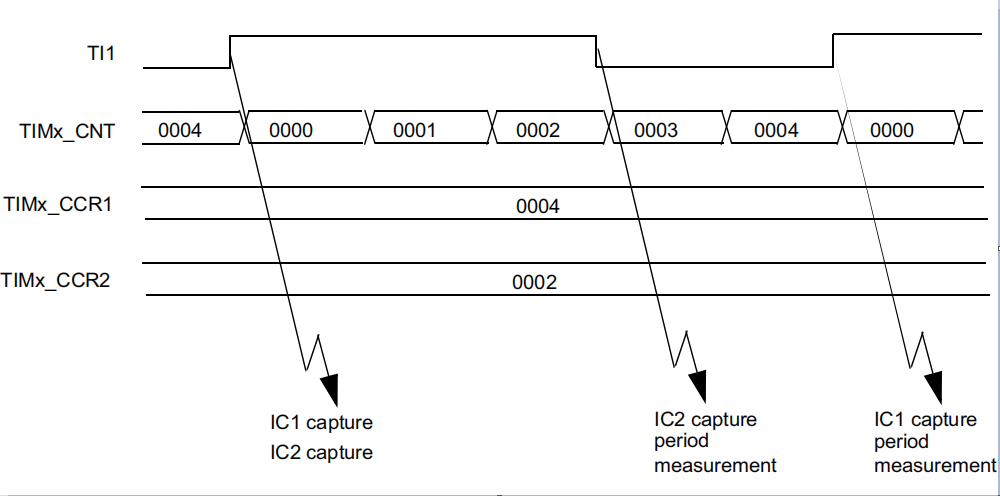

# PWM脉冲捕获

## 原理



捕获PWM波，是为了频率和占空比，这两种数据结果。通过IO中断和定时器的结合，可以记录对应一个脉冲的时间。通过前后的数值计算可以获得占空比、频率。\
通过一个定时器和多路IO中断，可以记录多个不同通道的PWM占空比、频率。


## Code

```c
typedef struct timer_capture_calc_t {
    uint16_t readvalue1;
    uint16_t readvalue2;
    __IO uint16_t ccnumber;
    __IO uint32_t count;
    __IO uint16_t fre;
    __IO bool idle_flag; /* true : the pwm capture is idle, if true fre set to zero */
} timer_capture_calc_t;

typedef struct fan_timer_config_t
{
    rcu_periph_enum timer_clock;
    uint32_t timer_base;
    uint16_t timer_channel;
    uint32_t gpio_port;
    uint16_t gpio_pin;
    /* IRQ */
    IRQn_Type timer_IRQ;
    uint32_t channel_interrupt_flag;
    uint32_t channel_interrupt_enable;
    timer_capture_calc_t * p_st_calc;
} fan_timer_config_t;

void channel_n_IRQ(const fan_timer_config_t *fan_timer_config){
    if (SET == timer_interrupt_flag_get(fan_timer_config->timer_base, fan_timer_config->channel_interrupt_flag))
    {
        /* clear channel 0 interrupt bit */
        timer_interrupt_flag_clear(fan_timer_config->timer_base, fan_timer_config->channel_interrupt_flag);
        fan_timer_config->p_st_calc->idle_flag = false;

        if (0 == fan_timer_config->p_st_calc->ccnumber)
        {
            /* read channel 0 capture value */
            fan_timer_config->p_st_calc->readvalue1 = timer_channel_capture_value_register_read(fan_timer_config->timer_base, fan_timer_config->timer_channel) + 1;
            fan_timer_config->p_st_calc->ccnumber = 1;
        }
        else if (1 == fan_timer_config->p_st_calc->ccnumber)
        {
            /* read channel 0 capture value */
            fan_timer_config->p_st_calc->readvalue2 = timer_channel_capture_value_register_read(fan_timer_config->timer_base, fan_timer_config->timer_channel) + 1;

            if (fan_timer_config->p_st_calc->readvalue2 > fan_timer_config->p_st_calc->readvalue1)
            {
                fan_timer_config->p_st_calc->count = (fan_timer_config->p_st_calc->readvalue2 - fan_timer_config->p_st_calc->readvalue1);
            }
            else
            {
                fan_timer_config->p_st_calc->count = ((0xFFFFU - fan_timer_config->p_st_calc->readvalue1) + fan_timer_config->p_st_calc->readvalue2);
            }

            fan_timer_config->p_st_calc->fre = 1000000U / fan_timer_config->p_st_calc->count; // timer period is 1000000U
            fan_timer_config->p_st_calc->ccnumber = 0;
        }
    }
}


void main(){
    if (cw_wheel_fg.p_st_calc->idle_flag == true) {
        /* 若为true，色轮未触发IO中断 */
        cw_wheel_fg.p_st_calc->fre = 0;
        EXCUTE_ONCE(ULOG_ERROR("CW wheel speed is zero\n"));
    }
    cw_wheel_fg.p_st_calc->idle_flag = true; /* 主循环中置位为true，中断置位为false */ 

    delay(500); // make sure Much greater than the PWM period
}

```