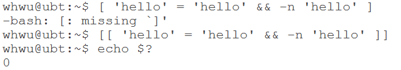
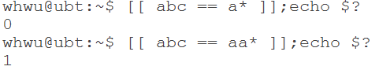
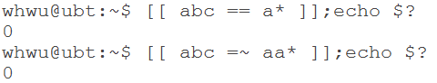

# \[\[ \]\]命令完全等价于TEST，只是写法不同。

## \[\[ \]\] 基本等价于TEST命令，但其支持更多的表达式；可以认为 \[\[ \]\] 是 \[ \] 和 expr 命令相加

- \[\[ \]\] 支持逻辑运算表示为 `&&` `||` `!` `()`，且 \[\[ \]\] 不在支持 `-a` `-o`

> 

- \[\[ \]\] 支持正则表达式匹配，注意以下几点：
  - 当条件表达式中使用的运算符是`==`或者`!=`时，运算符的右边会当作pattern作为匹配。但此时只做通配符匹配，不支持正则表达式匹配。通配符包括：`*` `?` `.`等
  >

  - 当条件表达式中使用的运算符是 **\=~** 时，该运算符的右边会被当作正则表达式的pattern被匹配。
  >
  >>正则`*`是匹配前面的子表达式零次或者多次,通配符`*`代替一个或者多个字符
  >>
  >>`=~` 是指右边的**正则字符**是否能 匹配、部分匹配 左边字符
