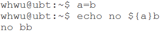

# ${ } $[ ] $( ) $(( )) 区分

## $( )与 \` \` 等价,都是进行命令替换

作用:先完成其中的命令,然后将其结果替换出来,再重组命令行.

>例如:
>
>

---

## $\[ \] 与 $(( )) 是进行整数运算

---

## ${ }是用作变量替换,可以对变量内容进行一些操作

### 简单的用法
   >

### 拓展用法

拓展用法对如下变量举例：
```shell
file=/dir1/dir2/dir3/my.file.txt
```

#### ${ } 变量替换进行截取：

`${file#\*/}` 拿掉第一条 / 及其左边的字符串 `dir1/dir2/dir3/my.file.txt`

`${file##\*/}` 拿掉最后一条 / 及其左边的字符串 `my.file.txt`

`${file%/\*}` 拿掉最后条 / 及其右边的字符串 `/dir1/dir2/dir3`

`${file%%/\*}` 拿掉第一条 / 及其右边的字符串 ` `

>解析:
>
> `#` 是去掉左边（键盘上#在 $ 的左边）
>
> `%` 是去掉右边（键盘上% 在$ 的右边）
>
>${file:0:5}：提取最左边的 5 个字节：/dir1
>
>${file:5:5}：提取第 5 个字节右边的连续5个字节：/dir2

#### ${ } 变量替换进行替换:

`${file/dir/path}` 将第一个dir 替换为path `/path1/dir2/dir3/my.file.txt`

`${file//dir/path}` 将全部dir 替换为 path `/path1/path2/path3/my.file.txt`

#### ${ } 变量替换针对不同的变数状态赋值(沒设定、空值、非空值)：

`${file-my.file.txt} `假如 `$file` 沒有设定，則使用 my.file.txt 作传回值。(空值及非空值時不作处理)

`${file:-my.file.txt} `假如 `$file` 沒有設定或為空值，則使用 my.file.txt 作傳回值。 (非空值時不作处理)

`${file+my.file.txt} `假如 `$file` 設為空值或非空值，均使用 my.file.txt 作傳回值。(沒設定時不作处理)

`${file:+my.file.txt} `若 `$file` 為非空值，則使用 my.file.txt 作傳回值。 (沒設定及空值時不作处理)

`${file=my.file.txt} `若 `$file` 沒設定，則使用 my.file.txt 作傳回值，同時將 `$file` 賦值為 my.file.txt 。 (空值及非空值時不作处理)

`${file:=my.file.txt} `若 `$file` 沒設定或為空值，則使用 my.file.txt 作傳回值，同時將 `$file` 賦值為my.file.txt 。 (非空值時不作处理)

`${file?my.file.txt} `若 `$file` 沒設定，則將 my.file.txt 輸出至 STDERR。 (空值及非空值時不作处理)

`${file:?my.file.txt} `若 `$file` 没设定或为空值，则将 my.file.txt 输出至 STDERR。 (非空值時不作处理)

`${#var}` 可计算出变量值的长度：

`${#file}` 可得到 27 ，因为/dir1/dir2/dir3/my.file.txt 是27个字节
