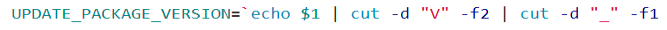

通配符必须是完全匹配

常用的shell命令 ls, find, cp等

-----
正则表达式可以进行一系列字符串的操作,包括字符串的==模式分割== ==匹配== ==查找== ==替换==操作,其中最重要的是==匹配==

支持正则表示式的shell命令:prep,awk,sed等

|元字符|作用|
|---|--|
|\*|前一个字符匹配0次或任意多次，匹配0次前一个字符则表示匹配任意字符，包括空白行|
|.|匹配除了换行符以外任意一个字符，“.\*”匹配所有内容|
|^|用于指定匹配字符串的头部，也称行首定位符；匹配行首。例如：^hello会匹配以hello开头的行，grep -n “^$” test.txt匹配空白行并显示行号|
|$|用于指定匹配字符串的尾部，也称行尾定位符；匹配行尾。例如：hello$会匹配以hello结尾的行|
|\[\]|匹配中括号中指定的任意一个字符，只匹配一个字符|
|\[^\]|匹配除中括号的字符以外的任意一个字符，只匹配一个字符|
|\\|转义符用于取消特殊符号的含义|
|\\{n\\}|表示其前面的字符恰好出现n次。例如：\[0-9\]\\{4\\}匹配4位数字|
|\\{n,\\}|表示其前面的字符出现不小于n次。例如：\[0-9\]\\{2,\\}匹配2位以上的数字|
|\\{n,m\\}|表示其前面的字符至少出现n次，最多出现m次。例如：\[a-z\]\\{6,8\\}匹配6到8位的小写字母|
|\||管道符，表示“或”，即匹配其中任何一个，”book\|desk”将匹配”book”或”desk”|
|()|小括号，可以将正则字符和元字符或表达式进行组合，”(book\|desk)s”将匹配”books”或”desks”|
|+|加号，匹配一个或多个前导表达式|
|\-|减号，用于指明字符范围， “\[a-c\]”将匹配包含a、b和c中任意一个字符的字符串|
|?|问号，匹配0个或1个前导表达式，如”a?”匹配其他字符串或a|
|\\<|反斜杠+小于号，词首定位符， “\\< abc”表示所有包含以”abc”开头的单词的行|
|\\>|反斜杠+大于号，词尾定位符， “\\>abc”表示所有包含以”abc”结尾的单词的行|

灰色表示扩展正则表达式

注意: grep -E pattern file 才能在pattern匹配扩展正则表达式

贪婪匹配

在满足匹配时，匹配尽可能长的字符串，默认情况下采用贪婪匹配

常用的非贪婪匹配Pattern

\*? 重复任意次，但尽可能少重复

+? 重复一次货更多次，但尽可能少重复

?? 重复0次或1次，但尽可能少重复

{n, m}? 重复n到m次，但尽可能少重复

{n,}? 重复ｎ次以上，但尽可能少重复

cut截取字符

>举例:
>
>1=ALPD4.0\_MONITOR\_UPDATE\_V1.00\_64f4ec92c0bab092ad08c0d4038b1f1f4bc729c9

\-d 表示截取分割字符

\-f1表示在左侧

\-f2表示在右侧

---

