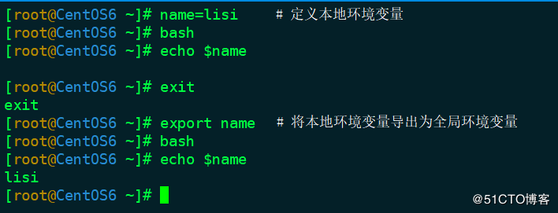

# 环境变量分为：全局环境变量 本地环境变量

1. **全局环境变量**
   - 存在于当前shell和子shell；(bash)下，使用env显示

    ```bash
    root@ubuntu:~# env
    SSH_CONNECTION=10.0.2.2 62062 10.0.2.15 22
    LESSCLOSE=/usr/bin/lesspipe %s %s
    LANG=en_US.UTF-8
    COLORTERM=truecolor
    VSCODE_GIT_ASKPASS_EXTRA_ARGS=
    S_COLORS=auto
    XDG_SESSION_ID=2
    USER=root
    PWD=/root
    HOME=/root
    BROWSER=/root/.vscode-server/bin/da76f93349a72022ca4670c1b84860304616aaa2/bin/helpers/browser.sh
    VSCODE_GIT_ASKPASS_NODE=/root/.vscode-server/bin/da76f93349a72022ca4670c1b84860304616aaa2/node
    TERM_PROGRAM=vscode
    SSH_CLIENT=10.0.2.2 62062 22
    ...
    ```


2. **本地变量**（全局变量以及局部变量）
    - 可以使用set命令查看

    ```bash
    root@ubuntu:~# set
    ARMGCC=/root/Code/opt/fsl-imx-fb/4.1.15-2.1.0/environment-setup-cortexa9hf-neon-poky-linux-gnueabi
    BASH=/bin/bash
    BASHOPTS=checkwinsize:cmdhist:complete_fullquote:expand_aliases:extquote:force_fignore:histappend:hostcomplete:interactive_comments:progcomp:promptvars:sourcepath
    BASH_ALIASES=()
    BASH_ARGC=()
    BASH_ARGV=()
    BASH_CMDS=()
    BASH_COMMAND=set
    BASH_LINENO=()
    BASH_REMATCH=()
    BASH_SOURCE=()
    BASH_VERSINFO=([0]="4" [1]="4" [2]="20" [3]="1" [4]="release" [5]="x86_64-pc-linux-gnu")
    BASH_VERSION='4.4.20(1)-release'
    BROWSER=/root/.vscode-server/bin/da76f93349a72022ca4670c1b84860304616aaa2/bin/helpers/browser.sh
    COLORTERM=truecolor
    COLUMNS=223
    DIRSTACK=()
    EUID=0
    GIT_ASKPASS=/root/.vscode-server/bin/da76f93349a72022ca4670c1b84860304616aaa2/extensions/git/dist/askpass.sh
    ...
    ```

---

## 环境变量操作
1. 删除环境变量 unset

    ```
    root@ubuntu:~# name=whwh
    root@ubuntu:~# echo $name
    whwh
    root@ubuntu:~# unset name
    root@ubuntu:~# echo $name
    root@ubuntu:~# 
    ```

    - 如果在子shell下删除全局环境变量，删除操作只对子shell有效，如果回到父shell下，该全局变量还能引用

    - shell脚本设置了环境变量，但是退出脚本后，这个变量就会消失，不会留在系统中。

2. 批量设置环境变量 source
   - 该命令常用 `.` 代替
   - `source` 命令会将脚本作为当前shell环境中执行,不会启动子shell,脚本中设置的环境变量会变成当前shell的一部分
   - 调用子shell不会影响当前shell的环境变量。直接执行一个脚本文件是在一个子shell中运行的，而source则是在当前shell环境中运行的。

3. 使用export命令将本地环境变量变为全局环境变量

    

4. 环境变量查看 
    - `env` `printenv` `export -p`

---

## 常用环境变量

- `#` 命令行的参数数量
- `1` 传递给脚本的第一个参数，2代表第二个，以此类推
- `*` 命令行的所有参数
- `$` 当前shell的PID
- `-` shell的属性
- `?` 最新shell命令的执行结果
- `PWD` 当前文件夹路径
- `PATH` 命令的搜索路径
- `~` 工作主目录
- `LOGNAME` 登录的用户名
- `PS1` 第一级的命令提示符
- `IFS` IFS是internal field separator的缩写，shell的特殊环境变量, shell通过`$IFS` 来解析输入和输出的分隔符.

