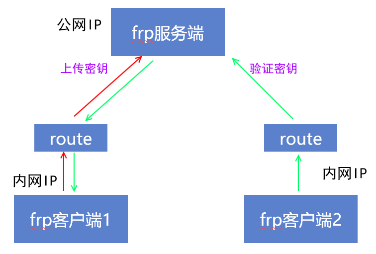

# frp进阶 stcp 以及 xtcp 模式

在 [](内网穿透-frd.md) 中,介绍了frp的tcp模式, tcp 模式存在两个问题

- 安全问题: frp的tcp模式相当于你的内网设备直接向公网暴露了一个tcp端口。任何设备都可以尝试连接这个端口。具有安全风险。
- 网络问题: 所有请求都需要进行frp的服务器进行中转，这里势必会造成比较大的网络延时。（尤其是我们大部分的vps是部署在国外）这对我们的服务响应速度会造成较大影响。同时,当VPS的上传带宽比较小的时候, 远程访问会比较卡.

## stcp 模式(安全)

STCP 的 (S) 的含义是 Secret。其作用是为 TCP 类型|的服务提供一种安全访问的能力，避免让端口直接暴露在公网上导致任何人都能访问到。

这两种代理要求在被访问服务的机器上以及要访问的用户的机器上都部署上 frp 的客户端。被访问的服务所在机器叫做服务端，另一端叫做访问端。

frp 会在访问端监听一个端口和服务端的端口做映射。访问端的用户需要提供相同的密钥才能连接成功，从而保证安全性。



### 如何配置

- 服务端：配置仍然同默认配置一致，直接运行即可
- 客户端：配置需要将type改为stcp，并且增加一个sk字段。这里不需要远端端口，因为不公开

frp客户端1
```ini
# frpc.ini
[common]
# 你的frp服务器的公网ip
server_addr = x.x.x.x
# 你的frp服务器的默认端口
server_port = 7000

[rdp]
type = stcp
# 只有 sk 一致的用户才能访问到此服务
sk = abcdefg
local_ip = 127.0.0.1
# 远程桌面的本地端口号
local_port = 3389
```

frp客户端2
```ini
# frpc.ini
[common]
# 你的frp服务器的公网ip
server_addr = x.x.x.x
# 你的frp服务器的默认端口
server_port = 7000

[rdp_visitor]
type = stcp
# stcp 的访问者
role = visitor
# 要访问的 stcp 代理的名字
server_name = rdp
# 只有 sk 一致的用户才能访问到此服务
sk = abcdefg
# 绑定本地端口用于访问 远程桌面 服务
bind_addr = 127.0.0.1
bind_port = 6000
```

在客户端2，使用127.0.0.1:6000即可访问客户端1的远程服务


## xtcp 模式(P2P模式)

XTCP 的配置方式和 STCP 很类似。但是会采用 P2P 的方式进行打洞穿透，如果成功，后续的流量将不会经过 frps，而是直接通信，不再受到 frps 所在服务器的带宽限制。

由于打洞成功率较低，所以 XTCP 的可用性和稳定性无法保证。在需要可靠连接的情况下，建议使用 STCP 替代。


### 如何配置

- 服务端需要增加一个udp端口 `bind_udp_port = 7001`
- 客户端1和客户端2只需要将stcp更改成xtcp即可(对比stcp)

> TCP 和 UDP 可以同时绑定相同的端口, `bind_udp_port = 7000` 也是可以的

frp的xtcp模式有几种情况是无法打通的，情况如下：

- NAT0: OpenInternet，没有经过NAT地址转换，公网IP
- NAT1: Full Cone NAT（全锥形NAT），动态家宽可以达到最优的状态，外网设备可以主动发信息给NAT1网络内的设备。
- NAT2: Address-Restricted Cone NAT（地址受限锥形NAT），只有内网设备(地址:任意端口)主动发过信息给外网设备，外网设备才能主动连接NAT2的该设备的地址(地址:任意端口)
- NAT3: Port-Restricted Cone NAT（端口受限锥形NAT），只有内网设备(地址:指定端口)主动发过信息给外网设备，外网设备才能主动连接NAT3的该设备的地址(地址:指定端口)，限制为通信过的端口
- NAT4: Symmetric NAT（对称NAT），只能和NAT0设备通讯

NAT有10种组合:
| 内网A        | 内网B        | 打通        |
| ------------ | ------------ | ----------- |
| 全锥型       | 全锥型       | ✓           |
| 全锥型       | 受限锥型     | ✓           |
| 全锥型       | 端口受限锥型 | ✓           |
| 全锥型       | 对称型       | ✓           |
| 受限锥型     | 受限锥型     | ✓           |
| 受限锥型     | 端口受限锥型 | ✓           |
| 受限锥型     | 对称型       | ✓           |
| 端口受限锥型 | 端口受限锥型 | ✓           |
| 端口受限锥型 | 对称型       | ✘, 无法打通 |
| 对称型       | 对称型       | ✘, 无法打通 |

对于出现无法打通的情况，我们还可以通过修改路由器或者光猫,控制家里那一端不是对称型，即使控制不了（运营商是对称型），此外我们还可以有一个备用tcp模式，绝大多数情况足够用了。


### 参考网址
https://xinyuehtx.github.io/post/%E5%86%85%E7%BD%91%E7%A9%BF%E9%80%8F%E7%A5%9E%E5%99%A8frp%E4%B9%8B%E8%BF%9B%E9%98%B6%E9%85%8D%E7%BD%AE.html
