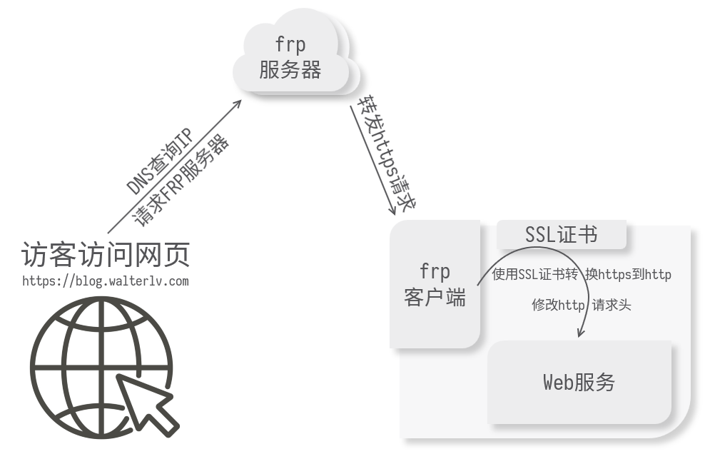

# frp

## 要点问答

1. frpc 客户端如何热更新对应的配置文件？
   1. 在frpc中启用admin（管理员）端口，用于提供 API 服务。在frpc.ini头部common段加入如下配置：
		```ini
		# frpc.ini
		[common]
		admin_addr = 127.0.0.1
		admin_port = 7400
		```
		之后,执行frpc所在目录重启命令:
		`./frpc reload -c ./frpc.ini`
		> 注意: 端口 7400 应该是本机的端口, 如果做了端口映射、DMZ、upnp等端口修改的操作,此方法不可行
	2. 新增frpc客户端服务,然后杀死旧的客户端进程
		```bash
		./frpc -c ./new/frpc.ini
		ps aux | grep "old/frpc.ini" | grep -v grep | awk '{print $2}' | xargs kill 
		```
		新增的frpc客户端进程在端口被占用时，会不断的尝试启用，大概隔20几秒就尝试一次。、
		大概等20几秒就可以更新客户端配置

## https代理

1. 工作原理
   

   访客在浏览器中输入网址 https://blog.walterlv.com 后，浏览器会查询 的 IP，查询到之后，向此 IP 的 443 端口发送 https 请求。frp 服务端收到此请求后检查访问的域名，发现曾经连接此 frp 服务端的一个客户端配置了此域名的反向代理。于是将请求转发给此客户端。frp 客户端在收到转发的 https 请求后，使用 SSL 证书将 https 解密成 http 请求，然后修改 http 头添加或修改额外的信息。最后，frp 客户端将修改后的 http 请求转发给本机的真正的 Web 服务程序。当 Web 服务程序处理完 Web 请求后，响应沿着原路返回。

   1. frp 服务端完全无法得知此 https 请求的内容, SSL 证书的一端在 frp 客户端
   2. 客户端的证书的网址是服务端的
   3. `plugin_crt_path = /etc/letsencrypt/live/你之前输入的域名/fullchain.pem` 
   4. `plugin_key_path = /etc/letsencrypt/live/你之前输入的域名/privkey.pem`

## F&Q

1. https反向代理 https://www.lidefish.tk 会异常, https://www.lidefish.tk/home.html 可以进行访问, 为什么?
   https://www.lidefish.tk 会解析成 http://127.0.0.1/home.html, 浏览器显示无法访问此网址
   https://www.lidefish.tk/home.html 会正常解析到云盘的https代理.不知道为什么?