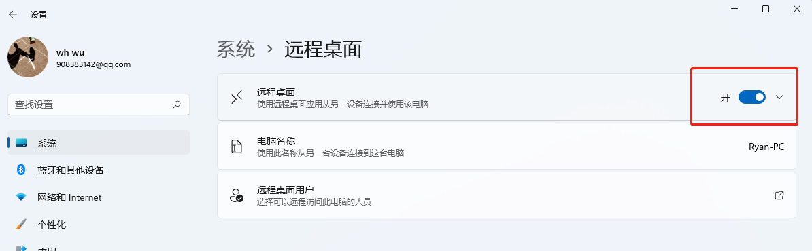
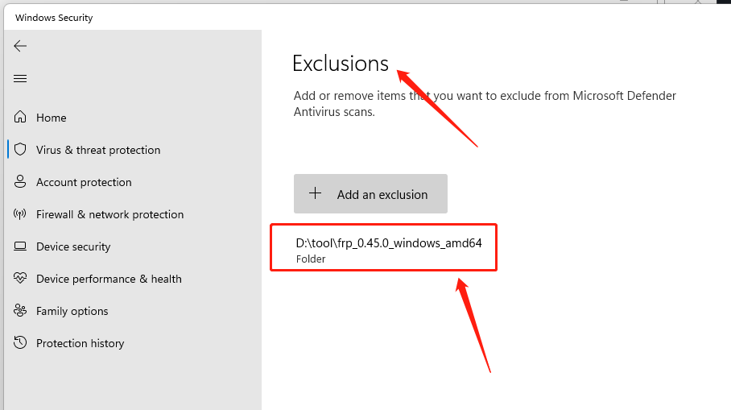
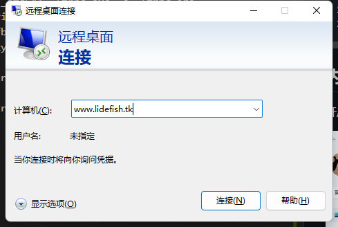

# 内网穿透 - 随时随地访问你的个人服务器

2020~2022年，神州大地发生了严重的新冠疫情，做核酸和疫情隔离形成了常态，经常会有因为疫情隔离的事情发生。为了保障工作的顺利进行，远程办公、远程教育火了起来。

提到远程办公，就不得不提一下内网穿透反向代理的理念，让大家在家就可以办公。

[fatedier/frp](https://github.com/fatedier/frp) 是一个可用于内网穿透的高性能的反向代理应用，支持 tcp, udp 协议，为 http 和 https 应用协议提供了额外的能力，且尝试性支持了点对点穿透。

```
     +-------------------------------------+
     |        public ip server C           |
     |                                     |
     |                frps                 |
     +-------------------------------------+
            ^                      ^
            |                      |
            |                      |
            |                      |
            |                      |
            v <---+ NAT            | <---+ NAT
 +--------------------------------------------+
 |          |          ||          |          |
 |      +-------+      ||      +-------+      |
 |      |   B   |      ||      |   A   |      |
 |target| frpc  |      || user |       |      |
 |      +-------+      ||      +-------+      |
 |          |          ||          |          |
 |      +-------+      ||      +-------+      |
 |                     ||                     |
 |         LAN         ||         LAN         |
 +--------------------------------------------+
```

在家有windows办公电脑A，在公司拥有windows办公电脑B，以及拥有公网服务器C，目标是实现内网穿透使个人电脑A能够公司电脑B。

> B电脑可以不止是一台电脑，也可以是一群电脑。
> 
> 可以增加一个路由器D在target的局域网内，负责办公电脑的开机，通过发送局域网魔术包（Wake on LAN）的方式，达到电源控制的目的。

**frp服务端的容器化部署**

https://github.com/ryiann/frp

在具有公网IP或者域名的服务器C中

拉取frp服务端
```bash
docker pull ryaning/frps
```

touch frps.ini
```ini
[common]
# frp 服务占用端口
bind_port = 7000
# frp stcp 服务占用端口
bind_udp_port = 7000
# 服务认证密码
token = NP7yQFe97bW6WWz
# 状态查询页面占用端口
dashboard_port = 7500
# 状态查询页面用户名
dashboard_user = admin
# 状态查询页面密码
dashboard_pwd = NP7yQFe97bW6WWz
# 服务器映射的域名
subdomain_host = www.lidefish.tk
```

启动frps服务
```bash
docker run --network host -v /root/frps/frps.ini:/etc/frp/frps.ini --name frps -d ryaning/frps
```

>--network host：容器使用宿主机的网络，指定我们的网络模式为host，这样我们访问本机的端口就能访问到我们的容器。

当服务启动完成，登录状态查询页面 `http://www.lidefish.tk:7500/`

**frp客户端部署**

在内网环境的电脑B中部署客户端

从github https://github.com/fatedier/frp/releases 上下载windows平台的frpc客户端 `frp_0.45.0_windows_amd64.zip`

编写frpc.ini配置文件
```ini
[common]
# 服务端IP地址或者域名,保持与服务端一致
server_addr = www.lidefish.tk
# 服务端的frp服务的端口,保持与服务端一致
server_port = 7000
# 服务认证密码,保持与服务端一致
token = NP7yQFe97bW6WWz

# 反向代理端口名代号, 名称唯一即可, 可以反向代理多个服务端口
[mstsc]   
# 代理类型，设置为tcp类型
type = tcp     
# 本地地址
local_ip = 127.0.0.1 
# 电脑在局域网中的内网 IP (如是本机，也可使用 127.0.0.1)，即本地需要暴露到公网的服务地址。也可以是局域网的其他电脑
local_port = 3389   
# 内网提供给外网访问的服务端口。
remote_port = 3389  

[rdp]
type = stcp
sk = NP7yQFe97bW6WWz
local_ip = 127.0.0.1
local_port = 3389
```

启动frpc客户端

```cmd
PS D:\tool\frp_0.45.0_windows_amd64> .\frpc.exe -c .\frpc.ini
2022/11/19 16:10:57 [I] [service.go:357] [c469d8ffbad30d15] login to server success, get run id [c469d8ffbad30d15], server udp port [0]
2022/11/19 16:10:57 [I] [proxy_manager.go:142] [c469d8ffbad30d15] proxy added: [mstsc rdp]
2022/11/19 16:10:57 [I] [control.go:177] [c469d8ffbad30d15] [mstsc] start proxy success
2022/11/19 16:10:57 [I] [control.go:177] [c469d8ffbad30d15] [rdp] start proxy success
```

## 内网穿透前准备

开启B电脑的远程桌面权限



最好局域网内验证一下,是否能用其他电脑访问电脑B的远程桌面

window 远程访问的默认端口就是 3389

B电脑的 frpc 客户端加入系统防火墙白名单



## 访问已经反向代理的B电脑



在内网环境中A电脑上打开远程连接，输入对应的服务IP:远程端口,即可实现远程桌面访问

## frp 连接提升安全性和网络速度

在被反向代理的客户端B电脑中,可以开启压缩和加密的功能

```ini
# frpc.ini
[ssh]
type = tcp
local_port = 22
remote_port = 6000
use_encryption = true
use_compression = true
```

如果公司内网防火墙对外网访问进行了流量识别与屏蔽，例如禁止了 SSH 协议等，通过设置 use_encryption = true，将 frpc 与 frps 之间的通信内容加密传输，将会有效防止流量被拦截。

如果传输的报文长度较长，通过设置 use_compression = true 对传输内容进行压缩，可以有效减小 frpc 与 frps 之间的网络流量，加快流量转发速度，但是会额外消耗一些 CPU 资源。

从 v0.25.0 版本开始 frpc 和 frps 之间支持通过 TLS 协议加密传输。通过在  frpc.ini  的 common 中配置  tls_enable = true  来启用此功能，安全性更高。

## 更多功能

- 范围端口映射

## frp开机自启动

从docker启动的服务端,增加 `--restart=always` 参数可以让docker容器随着系统自启动
> --restart=always：当 docker 重启时，容器自动启动。

windows 平台的客户端可以将启动命令整理成 bat 脚本, 放入 `启动` 文件夹中.

cmd 命令提示符下启动 FRP 虽然简单便捷，但一直启动着一个黑色的 cmd 界面看上去并不完美，更为重要的是，还会因无意中的关闭导致中断而没有任何办法。

NSSM(NSSM - the Non-Sucking Service Manager) 是一个可以将指定脚本或可执行程序注册为 Windows 系统服务的小巧而优秀的工具。同类型工具还有winsw 和 easy-service 等。

我们这里介绍使用 NSSM 将 FRP 启动脚本注册为 Windows 系统服务的方法。

1. 下载：从官网下载 NSSM，地址为：https://nssm.cc/download 注意，window10 系统要下载 prerelease 版本。

2. 解压：解压下载的 zip 文件至本地目录，根据当前电脑系统类型选择 win32 位或 win64 位目录下的 nssm.exe 文件，打开 cmd 命令提示符进入到该文件所在目录。

3. 服务注册：在 cmd 命令行输入 `./nssm.exe install frpc`，回车，在弹出的对话框中，path 处选择启动frpc的脚本，然后点击Install service注册服务。

     

     


>提示： 启动 frpc 的批处理脚本可以建立在客户端所在目录下。例如上图Path路径下选择的 start.bat文件，该文件是我自己建立的，新建一个文本文件，改后缀并命名为 start.bat，其内容仅为一行命令： `./frpc -c frpc.ini`

4. 服务启动：通过以上操作后，即可以在本地计算机服务列表中看到 frpc 服务。打开本地服务程序的方法为：按键 Win+R，输入 services.msc。


### 参考网址
1. https://gofrp.org/docs/examples/
2. https://geomatlab.com/frp-windows-rdp/
3. https://www.cnblogs.com/cainiao-chuanqi/p/15893227.html
4. https://github.com/ryiann/frp