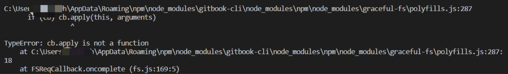

# 搭建 gitbook 服务

## 部署流程

GitBook依赖Node环境，所以需要先安装Node再全局安装GitBook

```bash
npm install gitbook-cli -g
gitbook init    #会在空项目中创建README.md和SUMMARY.md两个文件
gitbook build . #构建 Gitbook 静态网页
gitbook serve   #启动 gitbook 网页服务
```

>gitbook 命令可以方便地下载和安装不同版本的GitBook来测试你的书 `gitbook fetch 4.0.0`
>
>使用 `gitbook ls-remote` 列出可用于安装的远程版本

## 部署版本问题

node版本和gitbook的版本很多不兼容的情况.很多情况下,按照官网教程来,也不一定能部署成功.



## 启动服务

gitbook 启动网页服务后,更新gitbook项目的文件,会自动重载网页,更新显示内容

## 风格

在项目根目录下创建book.json，还可以针对特性格式用css设置样式

```json
"styles": {
  "website": "",
  "ebook": "",
  "pdf": "",
  "mobi": "",
  "epub": ""
}
```
例如隐藏侧边栏的Published with GitBook字样
```json
{
    "plugins": [
        "hide-element"             
    ],
    
    "pluginsConfig":{                 
        "hide-element": {
            "elements": [".gitbook-link"]	
        }
    }
}
```

>json 不支持注释，使用时需删除注释
> 
>gitbook 对book.json格式和内容不做检查，需要自行保证准确性


## gitbook 和 github page的集成

- www.gitbook.com 提供gitbook书籍项目的部署服务，可以将github中的书籍项目同步到gitbook中。
- github page 提供对应的域名 ` https://your_name.github.io/gitbook-example/`
- 通过github page 和 gitbook 的联动,就可以随时在网络上访问你的书籍了.
- 参考链接1 `https://qlzhu.github.io/blog/19654/`
- 参考链接2 `https://zhuanlan.zhihu.com/p/343212233`

## 使用docker搭建gitbook服务

使用对应的dockerfile进行搭建：**https://github.com/wwhRyan/gitbook**

```bash
# 构建书籍
docker run --rm -v `pwd`/notebook:/srv/gitbook fellah/gitbook gitbook build .

# 运行书籍服务，端口映射宿主机4000端口到容器4000端口
docker run -p 4000:4000 -v `pwd`/notebook:/srv/gitbook fellah/gitbook
```
