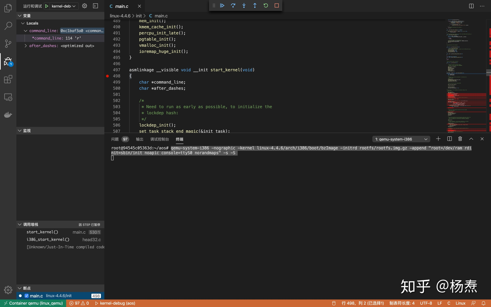

# vscode + docker + qemu 内核调试

为什么选择docker？

- Docker是基于golang开发的容器系统，开源免费轻量。在官方dockerhub上有着丰富的容器镜像。
- 启动一个容器的代价远小于启动虚拟机（vbox，vmware等）。
- Docker在window，mac和linux平台都可方便部署。避免使用破解软件，保护数据安全和隐私。

本系统需要用到的docker 镜像：`3292900173/qemu` 拉取和启动容器如下：

```bash
docker pull 3292900173/qemu 
docker run -it --name linux_qemu 3292900173/qemu /bin/bash 
```

gdb命令行调试真的让人头疼，采取vscode进行调试。

安装好vscode后，下载微软官方docker插件，如下


点看侧边栏的鲸鱼，就可以看到拉取的镜像和运行中的容器。

右键点击运行中的容器，选择 attach vscode 


进入容器后，打开对应的aos文件夹，在容器中安装 **`c/c++`** 微软官方插件。

安装vscode插件也挺费时的，第一次安装完成后，可以将调试文件夹挂载进去，避免在容器中重复安装插件

```bash
docker cp cb18a5fccd65:/root ./vmlinux-root
docker run -it --name linux_qemu --rm -v `pwd`/vmlinux-root:/root -w /root/aos 3292900173/qemu
```


配置debug的launch.json

```json
{
    // Use IntelliSense to learn about possible attributes.
    // Hover to view descriptions of existing attributes.
    // For more information, visit: https://go.microsoft.com/fwlink/?linkid=830387
    "version": "0.2.0",
    "configurations": [
        {
            "name": "kernel-debug",
            "type": "cppdbg",
            "request": "launch",
            "miDebuggerServerAddress": "127.0.0.1:1234",
            "program": "${workspaceFolder}/linux-4.4.6/vmlinux",
            "args": [],
            "stopAtEntry": false,
            "cwd": "${workspaceFolder}",
            "environment": [],
            "externalConsole": false,
            "logging": {
                "engineLogging": false
            },
            "MIMode": "gdb",
        }
    ]
}
```

输入如下指令运行 qemu + linux

```
qemu-system-i386 -nographic -kernel linux-4.4.6/arch/i386/boot/bzImage -initrd rootfs/rootfs.img.gz -append "root=/dev/ram rdinit=sbin/init noapic console=ttyS0 norandmaps" -s -S 
```
点击vscode调试按钮进行调试



>断点应放在函数的下一行,而不是直接在函数上。

如果docker pull失败了，可以直接使用下面的dockerfile：

```docker
FROM ubuntu:18.04


RUN echo "deb http://mirrors.aliyun.com/ubuntu/ bionic main restricted universe multiverse \n \
	deb-src http://mirrors.aliyun.com/ubuntu/ bionic main restricted universe multiverse \n \
	deb http://mirrors.aliyun.com/ubuntu/ bionic-security main restricted universe multiverse \n \
	deb-src http://mirrors.aliyun.com/ubuntu/ bionic-security main restricted universe multiverse \n \
	deb http://mirrors.aliyun.com/ubuntu/ bionic-updates main restricted universe multiverse \n \
	deb-src http://mirrors.aliyun.com/ubuntu/ bionic-updates main restricted universe multiverse \n \
	deb http://mirrors.aliyun.com/ubuntu/ bionic-proposed main restricted universe multiverse \n \
	deb-src http://mirrors.aliyun.com/ubuntu/ bionic-proposed main restricted universe multiverse \n \
	deb http://mirrors.aliyun.com/ubuntu/ bionic-backports main restricted universe multiverse \n \
	deb-src http://mirrors.aliyun.com/ubuntu/ bionic-backports main restricted universe multiverse" > /etc/apt/sources.list 


RUN cat /etc/apt/sources.list
RUN apt update 
RUN apt-get install -y wget \
    gcc \
    gcc-multilib \
    git \
    make \
    bc \
    gdb \
    libncurses5-dev \
    texinfo

RUN apt install -y qemu
RUN cd && mkdir aos && cd aos
RUN cd /root/ && echo "set auto-load safe-path /" > .gdbinit

RUN cd /root/aos/ && git clone https://gitee.com/mrsyangtao/roots.git
RUN cd /root/aos/ && mkdir rootfs && mv roots/* rootfs && rm -r roots


RUN cd /root/aos/ && wget http://ftp.sjtu.edu.cn/sites/ftp.kernel.org/pub/linux/kernel/v4.x/linux-4.4.6.tar.gz && tar zxvf linux-4.4.6.tar.gz

RUN cd /root/aos/ && cd linux-4.4.6  && make ARCH=i386 defconfig && \
    make ARCH=i386 CONFIG_DEBUG_KERNEL=y CONFIG_DEBUG_INFO=y CONFIG_GDB_SCRIPTS=y CONFIG_DEBUG_RODATA=n CONFIG_DEBUG_INFO_REDUCED=y CONFIG_CC_OPTIMIZE_FOR_SIZE=y -j 2
```         
保存为Dockerfile，在Dockerfile的目录下：

`docker build -t qemu .`
一样可以构建qemu镜像啦。