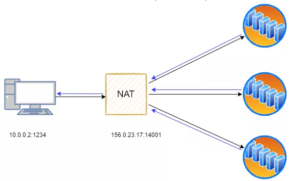
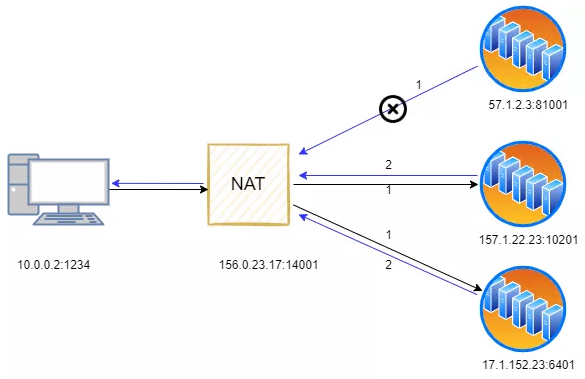
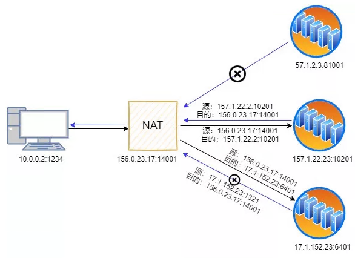

# 内网穿透 - 随时随地访问你的个人服务器

2020~2022年，神州大地发生了严重的新冠疫情，做核酸和疫情隔离形成了常态，经常会有因为疫情隔离的事情发生。为了保障工作的顺利进行，远程办公、远程教育火了起来。

提到远程办公，就不得不提一下内网穿透反向代理的理念，让大家在家就可以办公。

[fatedier/frp](https://github.com/fatedier/frp) 是一个可用于内网穿透的高性能的反向代理应用，支持 tcp, udp 协议，为 http 和 https 应用协议提供了额外的能力，且尝试性支持了点对点穿透。

```
     +-------------------------------------+
     |        public ip server C           |
     |                                     |
     |                frps                 |
     +-------------------------------------+
            ^                      ^
            |                      |
            |                      |
            |                      |
            |                      |
            v <---+ NAT            | <---+ NAT
 +--------------------------------------------+
 |          |          ||          |          |
 |      +-------+      ||      +-------+      |
 |      |   B   |      ||      |   A   |      |
 |target| frpc  |      || user |       |      |
 |      +-------+      ||      +-------+      |
 |          |          ||          |          |
 |      +-------+      ||      +-------+      |
 |                     ||                     |
 |         LAN         ||         LAN         |
 +--------------------------------------------+
```

在家有windows办公电脑A，在公司拥有windows办公电脑B，以及拥有公网服务器C，目标是实现内网穿透使个人电脑A能够公司电脑B。

> B电脑可以不止是一台电脑，也可以是一群电脑。
> 
> 可以增加一个路由器D在target的局域网内，负责办公电脑的开机，通过发送局域网魔术包（Wake on LAN）的方式，达到电源控制的目的。

**frp的容器化部署**

https://github.com/ryiann/frp

```
         +             +               +                  +                 +         +           +                    +
         |             |               |                  |                 |         |           |                    |
         |             |               |                  |                 |         |           |                    |
         |tls          |http           |http              |http             |ssh      |RDP        |http                |http
         |             |               |                  |                 |         |           |                    |
         |             |               |                  |                 |         |           |                    |
         |             |               |                  |                 |         |           |                    |
         v             v               v                  v                 v         v           v                    v

  +----------------------------------------------------------------------------------------------------------------------------------------+
  |   21210:21215    65432     |      80        |         9000        |     6000      3389     8080(or 443)   |       7500     7000        |
  |     V2ray         xui      |    gitbook     |      webhook        |     SSH       RDP        webdav       |       frp+ui   frp         |
  |                            |                |                     |                                       |                            |
  +------------------------------------^-------------------------------------^---------^----------^----------------------------------------+
  |                                    |        |     hooks/webhook   |      |         |          |                                        |
  |                     (pull new book)+--------+                     |      |stcp     |stcp      |stcp                                    |
  |                                             +---------------------+      |         |          |                                        |
  |                                             |    hooks/power_on   |      +         +          +                                        |
  |                                             |                     |    5:1022    2:3389     2:8080                                     |
  |                                             +---------------------+    +----+     +--------------+                                     |
  |                                                        |               |    |     |              |                                     |
  |                                                        +-------------->-----+     |              |                                     |
  |                                                            ssh           |        |              |                                     |
  |                                                                        +----+     +--------------+                                     |
  |                                                                           |              |                                             |
  |                                                                           |           +-----+                                          |
  |                                                                           +--------->                                                  |
  |                                                                            etherwake                                                   |
  +----------------------------------------------------------------------------------------------------------------------------------------+
```

---

## NAT

NAT（Network Address Translation，网络地址转换）通过使用少量的公有IP 地址代表较多的私有IP 地址的方式，将有助于减缓可用的IP地址空间的枯竭。

特点
- 宽带共享
- 安全防护

类型：
- NAT0: OpenInternet，没有经过NAT地址转换，公网IP
- NAT1: Full Cone NAT（全锥形NAT），所有从同一个内网的（IP，端口）发送出来的请求都会被映射到同一个外网（IP，端口），且任何一个外网主机都可以通过访问映射后的公网地址，实现访问位于内网的主机设备功能。外网主机可以主动连接内网主机。
  
- NAT2: Address-Restricted Cone NAT（地址受限锥形NAT），所有从同一个内网的（IP，端口）发送出来的请求都会被映射到通过一个外网（IP，端口），但与全锥形不同点在于：生成的映射表项与目的IP有关，只有符合要求的目的IP(要访问的公网服务器IP)才可以通讯。此NAT还有个特点：不能主动连接内网中的主机地址，连接必须由内网地址发起。限制比全锥形NAT多了：IP地址限制。此类型NAT除了与源IP和源端口相关外，还与目的IP有关，只有内网主机主动连接的公网IP才可以与内网中的主机通讯。
	
- NAT3: Port-Restricted Cone NAT（端口受限锥形NAT），所有从同一个内网的（IP，端口）发送出来的请求都会被映射到通过一个外网（IP，端口），但是在地址受限锥形NAT基础上增加了端口的限制。地址受限锥形NAT时，只有内网主机主动连接的公网主机才可与之进行通讯，而不用担心端口号是否与请求的端口相同。但是端口受限锥形NAT除了IP限制外，增加了端口限制。意思是说：除了之前主动连接了主机的（IP，port1,）可以通讯，其他的（IP，port2）等都不可以与之通讯。此NAT映射与报文的三元组绑定
	
- NAT4: Symmetric NAT（对称NAT），所有从同一个内网（IP，端口）发送到同一个目的IP和端口的请求都会被映射到同一个IP和端口。换句话说（SIP，Sport, DIP, Dport）只要有一个发生变化都会使用不同的映射条目，即此NAT映射与报文四元组绑定。

### 常用工具
检测nat类型


### tips
1. [中国电信天翼光猫改桥接摸式方法](https://www.yeboyzq.com/luyoujiaohuan/984.html#:~:text=%E7%99%BB%E5%BD%95%E5%90%8E%E7%82%B9%E5%87%BB%E2%80%9C%E7%BD%91%E7%BB%9C%E2%80%9D%E9%80%89%E9%A1%B9,%E7%82%B9%E2%80%9C%E4%BF%9D%E5%AD%98%E2%80%9D%E5%8D%B3%E5%8F%AF%E3%80%82)