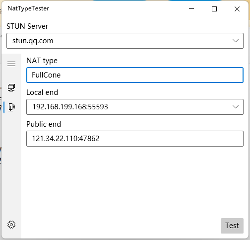

# 内网穿透 - 随时随地访问你的个人服务器

2020~2022年，神州大地发生了严重的新冠疫情，做核酸和疫情隔离形成了常态，经常会有因为疫情隔离的事情发生。为了保障工作的顺利进行，远程办公、远程教育火了起来。

提到远程办公，就不得不提一下内网穿透反向代理的理念，让大家在家就可以办公。

[fatedier/frp](https://github.com/fatedier/frp) 是一个可用于内网穿透的高性能的反向代理应用，支持 tcp, udp 协议，为 http 和 https 应用协议提供了额外的能力，且尝试性支持了点对点穿透。

```
     +-------------------------------------+
     |        public ip server C           |
     |                                     |
     |                frps                 |
     +-------------------------------------+
            ^                      ^
            |                      |
            |                      |
            |                      |
            |                      |
            v <---+ NAT            | <---+ NAT
 +--------------------------------------------+
 |          |          ||          |          |
 |      +-------+      ||      +-------+      |
 |      |   B   |      ||      |   A   |      |
 |target| frpc  |      || user |       |      |
 |      +-------+      ||      +-------+      |
 |          |          ||          |          |
 |      +-------+      ||      +-------+      |
 |                     ||                     |
 |         LAN         ||         LAN         |
 +--------------------------------------------+
```

在家有windows办公电脑A，在公司拥有windows办公电脑B，以及拥有公网服务器C，目标是实现内网穿透使个人电脑A能够公司电脑B。

> B电脑可以不止是一台电脑，也可以是一群电脑。
> 
> 可以增加一个路由器D在target的局域网内，负责办公电脑的开机，通过发送局域网魔术包（Wake on LAN）的方式，达到电源控制的目的。

**frp的容器化部署**

https://github.com/ryiann/frp

```
         +             +               +                  +                 +         +           +                    +
         |             |               |                  |                 |         |           |                    |
         |             |               |                  |                 |         |           |                    |
         |tls          |http           |http              |http             |ssh      |RDP        |http                |http
         |             |               |                  |                 |         |           |                    |
         |             |               |                  |                 |         |           |                    |
         |             |               |                  |                 |         |           |                    |
         v             v               v                  v                 v         v           v                    v

  +----------------------------------------------------------------------------------------------------------------------------------------+
  |   21210:21215    65432     |      80        |         9000        |     6000      3389     8080(or 443)   |       7500     7000        |
  |     V2ray         xui      |    gitbook     |      webhook        |     SSH       RDP        webdav       |       frp+ui   frp         |
  |                            |                |                     |                                       |                            |
  +------------------------------------^-------------------------------------^---------^----------^----------------------------------------+
  |                                    |        |     hooks/webhook   |      |         |          |                                        |
  |                     (pull new book)+--------+                     |      |stcp     |stcp      |stcp                                    |
  |                                             +---------------------+      |         |          |                                        |
  |                                             |    hooks/power_on   |      +         +          +                                        |
  |                                             |                     |    5:1022    2:3389     2:8080                                     |
  |                                             +---------------------+    +----+     +--------------+                                     |
  |                                                        |               |    |     |              |                                     |
  |                                                        +-------------->-----+     |              |                                     |
  |                                                            ssh           |        |              |                                     |
  |                                                                        +----+     +--------------+                                     |
  |                                                                           |              |                                             |
  |                                                                           |           +-----+                                          |
  |                                                                           +--------->                                                  |
  |                                                                            etherwake                                                   |
  +----------------------------------------------------------------------------------------------------------------------------------------+
```

## NAT

检测nat类型

