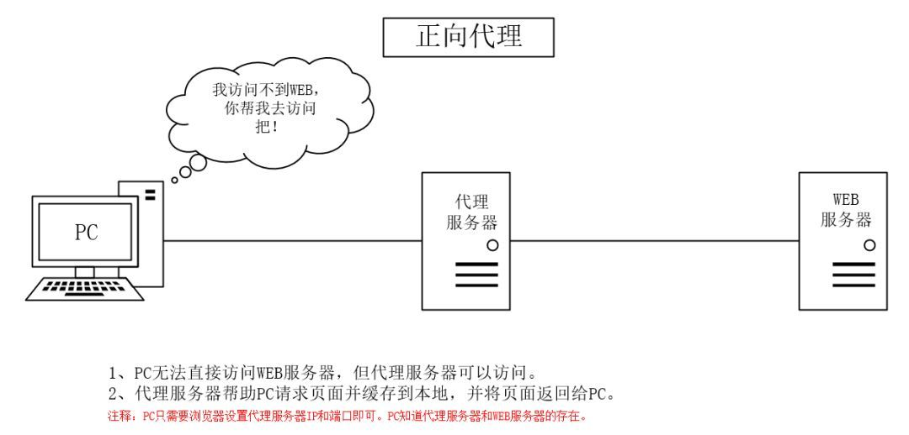

# 正向代理和反向代理

## 正向代理

有时候,用户不能直接访问一些国外网站,国外的一些vps可以正常的访问.用户先访问国外的vps,通过vps转发请求,并且vps会将请求的响应再返回给用户.这个过程就是正向代理.我们常说的"翻墙"就是正向代理的过程.

特点:
- 突破访问限制
- 提高访问速度
- 隐藏客户端真实IP
  
## 反向代理

web开发中,由于IPv4地址的枯竭,很多服务器处于NAT的局域网中,用户不能直接的访问.这个时候,内网web服务器可以将端口转发给公网的服务器.用户访问公网服务器,其再将请求转发到内网的web服务,并返回web服务的响应.我们常说的"内网穿透"、"负载均衡"就是一个反向代理的过程.

特点:
- 提供安全保障.公网服务器可以作为防火墙,对web攻击提供防护
- 提高访问速度.服务器端可以做负载均衡,实现客户需求分发
- 隐藏服务器真实IP