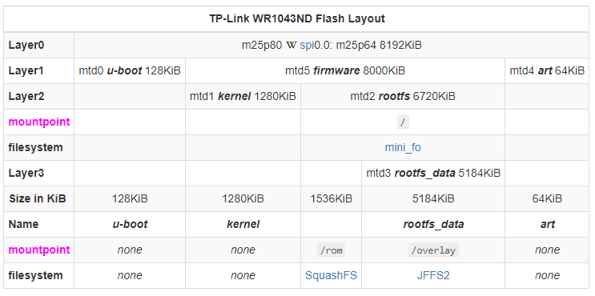

# openwrt

OpenWrt/LEDE是一个为嵌入式设备(通常是无线路由器)开发的高扩展度的GNU/Linux发行版。与许多其他路由器的发行版不同，OpenWrt是一个完全为嵌入式设备构建的功能全面、易于修改的由现代Linux内核驱动的操作系统。在实践中，这意味着您可以得到您需要的所有功能，却仍能避免臃肿。

## openwrt 发行版和 linux 普通发行版的区别(类似ubuntu)
- 内核打专属补丁
- 动态链接库精简，用了uclibc库而不是(e)glibc库
- 专用的软件包管理器opkg
- OpenWRT 上用的shell是 ash
- OpenWRT 网卡驱动支持ap功能
- 自带web配置界面 - luci
- 路由的核心功能是通过iptables实现，linux和openwrt都可以实现对应路由、NAT功能
- flash 文件系统定制，采用/overlay(jffs2 可读写) 与/rom(SqashFS 只读)共同构成统一的/根目录
- 采用精简的busybox、dropbear、iptables 作为roofts基础镜像，储存在SqashFS区域

## SquashFS

SquashFS是一个只读的压缩文件系统。虽然gzip可用，但在 OpenWrt，它使用LZMA进行压缩。由于 SquashFS 是一个只读文件系统，它不需要对齐数据，允许它更紧密地打包文件，因此占用的空间比 JFFS2 少得多（比 JFFS2 文件系统节省 20-30%）！

(+) 占用尽可能少的空间\
(+) 允许实施用于恢复的白痴证明FailSafe，因为不可能写入它\
(-) 只读\
(-) 浪费空间，因为每次修改其中包含的文件时，实际上都会将其副本复制到第二个 (JFFS2) 分区\
SquashFS 上的内核文档
SquashFs 性能比较
在 NAND 上运行 SquashFS 时有一个普遍的问题：问题是 SquashFS 根本没有坏块管理，需要所有块有序；但是对于正确的 NAND 坏块管理，您还需要能够跳过坏块并偶尔重新定位块（参见squashfs 和 NAND 闪存）。这就是为什么原始 SquashFS 在 NAND 上不是一个好主意（如果你使用像 UBIFS 这样的 FTL，它就可以工作）。

## JFFS2

JFFS2是一个可写的压缩文件系统，具有日志记录和磨损均衡功能，使用LZMA进行压缩。

(+) 可写，有日志记录和磨损均衡\
(+) 很酷\
(-) 是压缩的，所以程序（opkg特别是）无法提前知道一个包将占用多少空间\
(+) 是压缩的，所以程序（预装的）占用的空间要少得多，所以实际上你有更多的空间\
它已被 UBIFS 取代。

## Flash 布局

参考TP-Link TL-WR1043ND型号的分区图：

- 第0层Layer0: 对应Flash芯片,8MiB大小, 焊接在PCB上,连接到CPU(SoC)soc – 通过SPI (Serial Peripheral Interface Bus)总线.
- 第1层Layer1: 我们把存储空间“分区”为 mtd0 给 bootloader, mtd5 给 firmware/固件使用, 并且, 在这个例子中, mtd4给ART (Atheros Radio Test/Atheros电波测试) - 它包含MAC地址和无线系统的校准信息(EEPROM). 如果该部分的信息丢失或损坏,ath9k (无线驱动程序) 就彻底罢工了.
- 第2层Layer2: 我们把mtd5 (固件) 进一步分割为 mtd1 (kernel/内核) and mtd2 (rootfs); 在固件的一般处理流程中 (参考imagebuilder) Kernel 二进制文件 先由LZMA打包, 然后用gzip压缩 之后文件被 直接写入到raw flash (mtd1)中 而不mount到任何文件系统上!
- 第3层Layer3: 我们把rootfs更进一步分割成 mtd3 (rootfs_data) 和剩下的 未命名 部分 - 未来用来容纳SquashFS-分区.

## 引导过程

1. 内核从已知的原始分区（没有 FS）启动，扫描 mtd 分区rootfs以寻找有效的超级块并挂载 SquashFS 分区（包含/etc）然后运行/etc/preinit。（更多信息在technical.details）
2. /etc/preinit跑/sbin/mount_root
3. mount_root安装 JFFS2 分区 ( /overlay) 并将其与 SquashFS 分区 ( /rom) 结合以创建新的虚拟根文件系统( /)
4. 启动继续/sbin/init

## 参考文档
- https://openwrt.org/start

## FAQ

1. openwrt 的 DDNS 是什么意思？
	DDNS英文全称Dynamic Domain Name Server，中文含义是指动态域名服务。很多普通路由器或者智能路由器设置中，都可以找到DDNS（动态DNS）功能。\
	目前路由器拨号上网获得的多半是动态IP,DDNS可以将路由器变化的外网IP和固定的域名绑定，从而用户可以在外网通过该固定域名进行访问路由器。

2. DMZ 是什么意思?
	demilitarized zone, 是一个将局域网 (LAN) 与其他不受信任的网络（通常是公共互联网）分隔开的物理或逻辑子网。在路由器中,不受信任的外部网络的访问都会转发到这个DMZ的的子网,其他部分的局域网对于外部互联网不可见.\
	设置DMZ可以提高特定电脑的NAT等级,并将其他局域网电脑的NAT等级设置为最低的对称型.