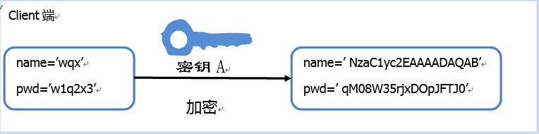
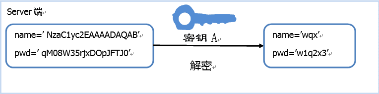
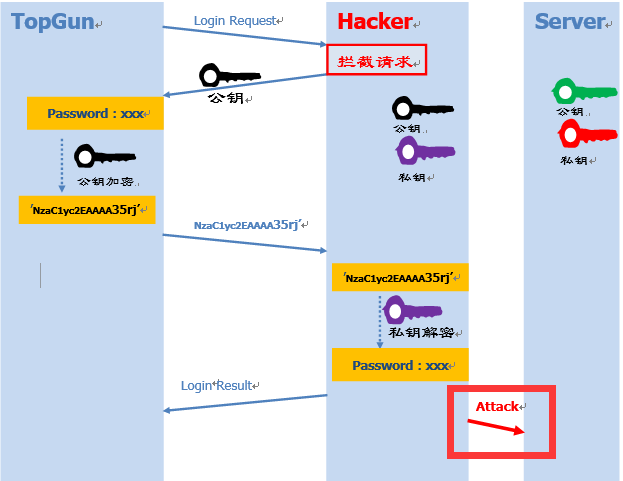
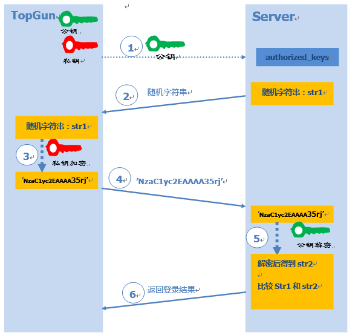

## 1\. SSH简介

[SSH](http://www.ietf.org/rfc/rfc4251.txt)是一种协议标准，其目的是实现**安全远程登录**以及其它**安全网络服务**。

> SSH仅仅是一**协议标准**，其具体的实现有很多，既有开源实现的OpenSSH，也有商业实现方案。使用范围最广泛的当然是开源实现OpenSSH。

## 2\. SSH工作原理

在讨论SSH的原理和使用前，我们需要分析一个问题：**为什么需要SSH？**

从1.1节SSH的定义中可以看出，SSH和telnet、ftp等协议主要的区别在于**安全性**。这就引出下一个问题：**如何实现数据的安全呢？**首先想到的实现方案肯定是对数据进行**加密**。加密的方式主要有两种：

1.  对称加密（也称为秘钥加密）
2.  非对称加密（也称公钥加密）

所谓对称加密，指加密解密使用同一套秘钥。如下图所示：

图1-1：对称加密-Client端

图1-2：对称加密-Server端

对称加密的加密强度高，很难破解。但是在实际应用过程中不得不面临一个棘手的问题：**如何安全的保存密钥呢？**尤其是考虑到数量庞大的Client端，很难保证密钥不被泄露。一旦一个Client端的密钥被窃据，那么整个系统的安全性也就不复存在。为了解决这个问题，**非对称加密**应运而生。非对称加密有两个密钥：**“公钥”**和**“私钥”**。

> 两个密钥的特性：公钥加密后的密文，只能通过对应的私钥进行解密。而通过公钥推理出私钥的可能性微乎其微。

下面看下使用非对称加密方案的登录流程：

图1-3：非对称加密登录流程

1.  远程Server收到Client端用户TopGun的登录请求，Server把自己的公钥发给用户。
2.  Client使用这个公钥，将密码进行加密。
3.  Client将加密的密码发送给Server端。
4.  远程Server用自己的私钥，解密登录密码，然后验证其合法性。
5.  若验证结果，给Client相应的响应。

> 私钥是Server端独有，这就保证了Client的登录信息即使在网络传输过程中被窃据，也没有私钥进行解密，保证了数据的安全性，这充分利用了非对称加密的特性。

###### 这样就一定安全了吗？

上述流程会有一个问题：**Client端如何保证接受到的公钥就是目标Server端的？**，如果一个攻击者中途拦截Client的登录请求，向其发送自己的公钥，Client端用攻击者的公钥进行数据加密。攻击者接收到加密信息后再用自己的私钥进行解密，不就窃取了Client的登录信息了吗？这就是所谓的[中间人攻击](https://en.wikipedia.org/wiki/Man-in-the-middle_attack)

图1-4：中间人攻击

###### SSH中是如何解决这个问题的？

##### 1\. 基于口令的认证

从上面的描述可以看出，问题就在于**如何对Server的公钥进行认证？**在https中可以通过CA来进行公证，可是SSH的**publish key**和**private key**都是自己生成的，没法公证。只能通过Client端自己对公钥进行确认。通常在第一次登录的时候，系统会出现下面提示信息：

    The authenticity of host 'ssh-server.example.com (12.18.429.21)' can't be established.
    RSA key fingerprint is 98:2e:d7:e0:de:9f:ac:67:28:c2:42:2d:37:16:58:4d.
    Are you sure you want to continue connecting (yes/no)?

上面的信息说的是：无法确认主机ssh-server.example.com（12.18.429.21）的真实性，不过知道它的公钥指纹，是否继续连接？

> 之所以用fingerprint代替key，主要是key过于长（RSA算法生成的公钥有1024位），很难直接比较。所以，对公钥进行hash生成一个128位的指纹，这样就方便比较了。

如果输入**yes**后，会出现下面信息：

    Warning: Permanently added 'ssh-server.example.com,12.18.429.21' (RSA) to the list of known hosts. 
    Password: (enter password)

该host已被确认，并被追加到文件**known\_hosts**中，然后就需要输入密码，之后的流程就按照图1-3进行。

##### 2.基于公钥认证

在上面介绍的登录流程中可以发现，每次登录都需要输入密码，很麻烦。SSH提供了另外一种可以免去输入密码过程的登录方式：公钥登录。流程如下：

图1-5：公钥认证流程

1.  Client端用户TopGun将自己的公钥存放在Server上，追加在文件authorized\_keys中。
2.  Server收到登录请求后，随机生成一个字符串str1，并发送给Client。
3.  Client用自己的私钥对字符串str1进行加密。
4.  将加密后字符串发送给Server。
5.  Server用之前存储的公钥进行解密，比较解密后的str2和str1。
6.  根据比较结果，返回客户端登陆结果。