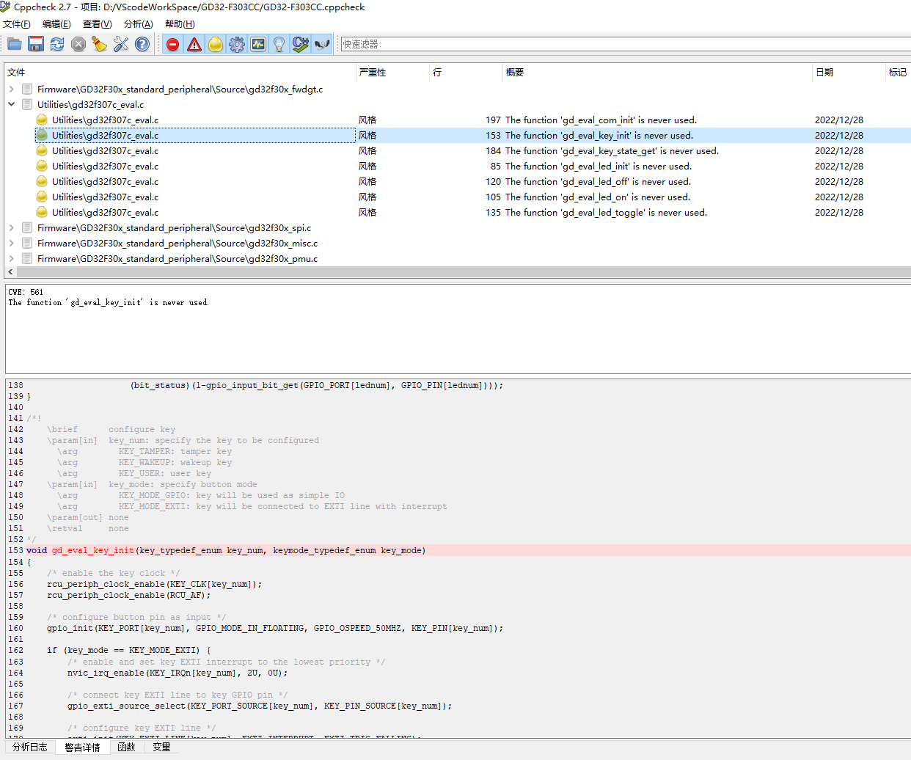

# cppcheck

## 参考整理

https://cppcheck.sourceforge.io/manual.pdf

## cppcheck 建立项目

使用`compile_commands.json`能很好的建立项目间文件的编译关系，这种方式建立的项目，不会出现分析日志一大堆头文件找不到的问题。

### GUI


### cmake
Generate a compile database:
```cmake
cmake -DCMAKE_EXPORT_COMPILE_COMMANDS=ON .
```
The file compile_commands.json is created in the current folder. Now run
Cppcheck like this:

```cmake
cppcheck --project=compile_commands.json
```
To ignore certain folders you can use -i. This will skip analysis of source files in
the foo folder.

```cmake
cppcheck --project=compile_commands.json -ifoo
```

### make
If you can generate a compile database, then it is possible to import that in
Cppcheck.
In Linux you can use for instance the bear (build ear) utility to generate a
compile database from arbitrary build tools:

```bash
bear make
```

或者使用github项目的 [nickdiego / compiledb](https://github.com/nickdiego/compiledb),Tool for generating Clang's JSON Compilation Database file for GNU make-based build systems.

## cppcheck 检测结果




