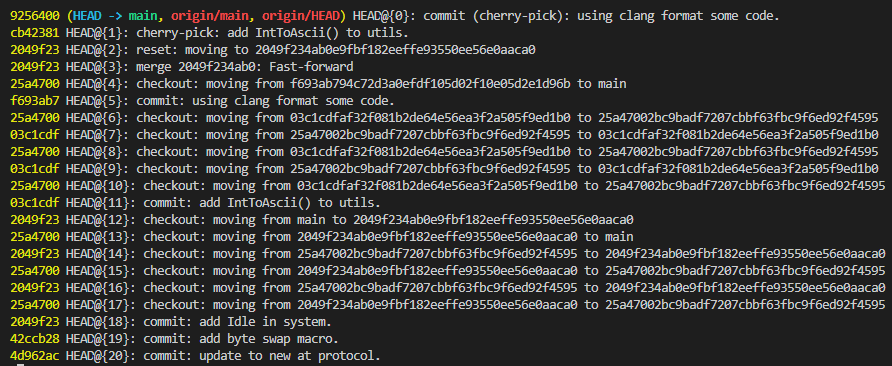

# 基本的git操作

## 文件添加

- git 无法添加空文件夹
- [git提示“warning LF will be replaced by CRLF”](sub/Git%E6%8F%90%E7%A4%BA%E2%80%9Cwarning%20LF%20will%20be%20replaced%20by%20CRLF%E2%80%9D%20-%20Microsoft%20OneNote.md)

## 修改撤回
- 已暂存撤回\
    `git reset HEAD`

- 未暂存撤回\
    `git checkout .`

## 文件删除
- 查看将要被删除的文件\
    `git clean -n`
    
- 删除未跟踪文件\
    `git clean -df`
    > -d 删除
    > -f 强制

- 取消文件的跟踪\
    `git rm -rf --cache file`

## 误操作恢复

本地git仓库的所有操作都是可以撤回以及重新编辑的。通过reflog来查看本地仓库的各种操作，包括提交、切换分支、cherry-pick等。

`git reflog`

