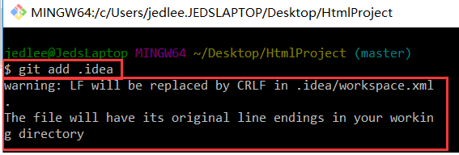

# git 提示“warning: LF will be replaced by CRLF”

## 问题描述：
windows平台下使用git add，git deploy 文件时经常出现“warning: LF will be replaced by CRLF” 的提示

## 问题背景：

1. 换行符‘\\n’和回车符‘\\r’

    在计算机还没有出现之前，有一种叫做电传打字机（Teletype Model 33）的玩意，每秒钟可以打10个字符。但是它有一个问题，就是打完一行换行的时候，要用去0.2秒，正好可以打两个字符。要是在这0.2秒里面，又有新的字符传过来，那么这个字符将丢失。

    于是，研制人员想了个办法解决这个问题，就是在每行后面加两个表示结束的字符。一个叫做“回车”，告诉打字机把打印头定位在左边界；另一个叫做“换行”，告诉打字机把纸向下移一行。

   - 回车符就是回到一行的开头，用符号r表示，十进制ASCII代码是13，十六进制代码为0x0D，回车（return）；
   - 换行符就是另起一行，用n符号表示，ASCII代码是10，十六制为0x0A， 换行（newline）。

2. LF和CRLF区别

    LF: Line Feed 换行
    >feed v.喂养,供给;将(信息)输入     line feed直译是”将行输入”,再意译”换行”

    CRLF: Carriage Return Line Feed 回车换行

    >Carriage n.马车,火车车厢;运输费用    在carriage return中,carriage译为“车”,return译为“回”

    在过去的机械打字机上有个部件叫「字车」（Typewriter carriage），每打一个字符，字车前进一格，打完一行后，我们需要让字车回到起始位置，而“Carriage Return”键最早就是这个作用，因此被直接翻译为「回车」。尽管后来回车键的作用已经不止” 倒回字车”那么简单，但这个译名一直被保留下来。

3. 不同操作系统下，处理行尾结束符的方法是不同的：

   - Windows和Dos下：使用回车（CR）和换行（LF）两个字符来结束一行，回车+换行(CR+LF)，即“\\r\\n”；

   - Unix和mac下：只使用换行（LF）一个字符来结束一行，即“\\n”；

   >(最早Mac每行结尾是回车CR 即'\\r'，后mac os x 也投奔了 unix)

4. Git下处理“换行”（line ending）

    core.autocrlf是git中负责处理line ending的变量，可以设置3个值：true，false，input。

    - 设置为true【config --global core.autocrlf true】

    当设置成true时，这意味着你在任何时候添加(add)文件到git仓库时，git都会视为它是一个文本文件(text file)。

    它将把crlf变成LF。

    - 设置为false【config --global core.autocrlf false】

    当设置成false时，line endings将不做转换操作。文本文件保持原来的样子。

    - 设置为input时，添加文件git仓库时，git把crlf编程lf。当有人Check代码时还是lf方式。因此在window操作系统下，不要使用这个设置。

## 分析问题

这句警告出现的原因：我们在Windows平台下git add任意Windows平台编辑过的代码文本的换行默认都是CRLF，所以一般git add不会出错。但是如果如下的(i)或者(ii)发生了，那我们再进行git add这个LF换行的文件时，会出现这个警告" LF will be replaced by CRLF in …"。

(i)我们的团队成员是Linux/Mac平台并参与了项目的git提交

(ii)我们Windows平台的某些软件会生成换行是LF的代码文本(如李俊德git add的是Webstorm生成的HTML项目中隐藏文件夹.idea中的workspace.xml,这个xml文件换行是LF)

## 问题的负面影响

格式化与多余的空白字符，特别是在跨平台情况下，有时候是一个令人发指的问题。由于编辑器的不同或者文件行尾的换行符在 Windows 下被替换了，一些细微的空格变化会不经意地混入提交，造成麻烦。虽然这是小问题，但会极大地扰乱跨平台协作。

假如你正在Windows上写程序;又或者你正在和其他人合作，他们在Windows上编程，而你却在其他系统上，在这些情况下，你可能会遇到行尾结束符问题。此问题的全部负面影响如下：

(1)一个直接后果是，Unix/Mac系统下的一个“多行文本”文件在Windows里打开的话，“多行文本”会变成“一行”。（原因：Unix/Mac换行只用了换行符‘\\n’，而Windows的换行要求是回车换行符’\\r\\n’，因此Unix/Mac中的“多行文本”的换行不符合Windows的规则，所以Windows对这些不符合换行规则的“多行文本”全部按照“没有换行”处理，所以导致“多行文本”会变成“一行”）

(2)而Windows里的文件在Unix/Mac下打开的话，在每行的结尾可能会多出一个^M符号。

(3)Linux保存的文件在windows上用记事本看的话会出现黑点。

## 解决此问题的方案

(1)如果我们目前是Window平台并出现该警告，**啥也别做就行**，虽然这个警告难看，但这个警告能保证我们项目团队正常跨系统git操作代码

因为git的Windows 客户端基本都会默认设置 core.autocrlf=true（我们可通过git config core.autocrlf命令查询我们的Windows上该属性是否默认true。如不是true,通过config --global core.autocrlf true命令设置该属性为true），而“core.autocrlf=true”有以下3个功能来避免我们出错：

(A)在“把 modified修改过的文件git add到暂存区stage”时，Git自动把LF转换成CRLF,并给出那条警告”LF will be replaced by CRLF”

(B)在“把modified修改过的文件由暂存区(stage) 提交(commit)到版本库/仓库(repository)”时，Git自动把CRLF转换成LF

(C)在“用 检出/git checkout切换到指定分支 或 git clone克隆远程版本库”来加载代码时，Git自动把LF转换成CRLF

提到的那句警告：“IF will be replaced by CRLF in <file-name>”

这句警告的下面其实还有一句很重要的话：The file will have its original line endings in your working directory.

>(翻译："在工作区里，这个文件会保留它原本的换行符")

(2)如果我们是Linux 或 Mac平台,我们不需要(1)(C)的功能“在检出或克隆远程版本库时，Git自动把LF转换成CRLF”。然而当一个CRLF作为行结束符的文件在我们的Linux 或 Mac平台不小心被引入时，你肯定想让 Git 修正。 所以，你可以通过config --global core.autocrlf input命令把 core.autocrlf 设置成 input 来告诉 Git 在提交(commit)时把CRLF转换成LF，检出(git checkout)时不转换

(1)+(2):这样在 Windows 上的检出(checkout)文件中会保留CRLF，而在 Mac 和 Linux 上，以及版本库中会保留LF，从而保证我们项目团队正常跨系统git操作代码

---

原文链接：https://blog.csdn.net/wq6ylg08/article/details/88761581

---
