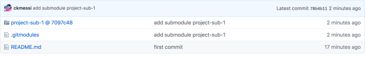

# submodule

Git可以包含多个子仓库(submodule)，以应对比较复杂的项目。主项目依赖于子项目，但是又不关心子模块的内部开发流程。
>tip：如果不想使用子仓库（submodule），可以将子仓库加入.gitignore中，可以无视子项目的存在。弊端是使用主项目的人以来先验知识，他需要心里很清楚每个子项目在哪个位置。

Git 的submodule功能时建立主项目与子项目之间的关系：子项目路径、子项目的远程仓库、子项目的Commit。

## 使用说明：

1. ### 创建submodule

    `git submodule add <submodule URL>`

	创建一个子模块，此时主项目会出现两个新文件.gitmodules和submodule文件夹

	.gitmodules 包含子模块的相关信息（路径，远程仓库URL，仓库文件夹）

	```bash
	  [submodule "project-sub-1"]
	  path = project-sub-1
	  url = https://github.com/username/pro……
	```

	.git/modules 也会出现新的文件夹，包含子模块的相应的信息

	创建子模块后，使用 `git commit -m "xxx" `即可完成子项目的添加。

	


2. ### 拉取submodule

	a. 直接拉取所有仓库。

	`git clone --recursive https://github.com/username/pro…… `

	b. 在已拉取的主仓库执行以下命令

	```bash
	git submodule init
	git submodule update
	```

	这个方法会根据主项目已配置信息，拉取子项目的代码

3. ### submodule更新

	对于子项目，并不需要知道自己是否被哪个主项目包含。本身就是一个完整的git仓库，按照正常的git代码操作即可

	对于主项目，子项目的内容出现变动时，有以下三种情况：

	a. **子项目的内容发生未跟踪或者已跟踪的变动**，git add / git commit 不会影响子项目的变动，不会添加或者提交子项目的改动。
	```bash
	On branch master
	Your branch is ahead of 'origin/master' by 1 commit.
	(use "git push" to publish your local commits)

	Changes not staged for commit:
	(use "git add <file>..." to update what will be committed)
	(use "git restore <file>..." to discard changes in working directory)
	(commit or discard the untracked or modified content in submodules)
	modified: MODE/S4mini4K\_DLP\_MCU\_stm32f730 (modified content)

	no changes added to commit (use "git add" and/or "git commit -a")
	```

	b. **子项目有版本变化**，git add / git commit 会变动子项目的版本信息，主项目可以添加和提交子项目版本变化，可以理解是子仓库的"COMMIT指针"的变化。
	```bash
	On branch master
	Your branch is ahead of 'origin/master' by 1 commit.
	(use "git push" to publish your local commits)

	Changes to be committed:
	(use "git restore --staged <file>..." to unstage)
	modified: MODE/S4mini4K\_DLP\_MCU\_stm32f730
	```

	c. **子项目有远程仓库的更新**，子项目和主项目的开发不会是恰好相同的，通常子项目有多人维护，其他成员维护其子项目后推送到远程仓库。

	此时，主项目是一无所知的，主项目的 `git status` 不会显示任何变化，同时 git submodule update也不会发生变化，毕竟主仓库记录的子模块没有发生变化。需要主动进入子项目拉取新的远程仓库的更新，进行升级操作，流程为：

	```bash
	cd submodule
	git pull origin master
	cd master project
	git add .
	git commit -m "xxx"
	```

	当子项目很多时，这个操作会很繁琐，有一个简单技巧：

	`git submodule foreach 'git pull origin master'`

	d. 单独更新一个子项目，（由于网络不佳或者重新拉取单个子项目）

	`git submodule [--quiet] update [<options>] [--] [<path>…​]`

	>Single pull one submodule like FreeRTOS/Source, example: git submodule update FreeRTOS/Source
	>There are lots of option for update: \[--init\] \[--remote\] \[-N|--no-fetch\] \[--\[no-\]recommend-shallow\] \[-f|--force\] \[--checkout|--rebase|--merge\] \[--reference <repository>\] \[--depth <depth>\] \[--recursive\] \[--jobs <n>\] \[--\] \[<path>…​\]

4. ### 删除submodule
   
	a. **卸载子项目，使用** `git submodule deinit submodule` **命令。这个命令加上一个** `--force（-f）` **参数，则子模块工作区即使有本地的修改，也会被移除。**

	**实际效果是删除了在** **.git/config 中的以下内容：**

	```bash
	[submodule "MODE/S4mini4K_DLP_MCU_stm32f730"]
	url = git@172.32.252.249:mcu/source/S4mini4K_DLP_MCU_stm32f730.git
	active = true
	```

	b. **此时还剩下**submodule**的空文件夹，执行**`git rm submodule`**，移除**submodule**文件夹，并在 .**gitmodules **中删除以下内容：**

	```
	[submodule "MODE/S4mini4K_DLP_MCU_stm32f730"]
	path = MODE/S4mini4K_DLP_MCU_stm32f730
	url = git@172.32.252.249:mcu/source/S4mini4K_DLP_MCU_stm32f730.git
	```

	c. **提交主项目commit，关于子项目的信息基本已删除**		

## 总结:

子模块在主项目的拉取和提交中，可以认为是一个子仓库的“指针”，主项目和子项目的修改和是分别独立的。\
submodule在主项目只是记录其版本信息。

-----

## git submodule 游离分支（detached）问题

### 背景介绍：

1. 在主仓库里，只记录 submodule 的commit id，相当于一个指向 submodule 的指针（为了描述方便，我们给这个指针起个名字叫sptr）。

2. 子模块的分支是记录在 .gitmodules 里的，sptr只记commit id, 不记其他任何信息，如果要改子模块分支，可以使用git config -f .gitmodules submodule.xxx.branch master命令。

3. 在主仓库下执行 git submodule update --remote 等价于进入 submodule 目录内，然后执行 git pull, 这两个操作都会把 submodule 目录中的文件(同样为了描述的方便，我们给它命名为scode)更新到最新，并且更新sptr。

4. 在主仓库执行 git pull 并不会更新scode, 哪怕pull之后sptr已经指向一个新的commit了，只有执行git submodule update, 才会更新scode。

5. 本地sptr产生变动后，把它push到origin, 这时其他人在拉代码时，都会更新sptr, 但scode是否更新，还要看他们是否执行了git submodule update

6. 当子模块在detached分支时，主仓库git status不会意识到有问题，当git submodule update时，同步的是commit id的detached分支中


### 产生原因：

**简单来说，就是主仓库的sptr指向一个你本地不存在的commit id时，子模块就会进入游离分支。**

举个例子，假如有个子模块 s1, 有100次提交，为了方便，我们假设commit id 就是1～100这样的数字。

本来 sptr 指向100，也没人更新子模块，这时大家都相安无事，直到有一个人更新了子模块，并push了一个commit id=101的提交，并且他还把sptr更新到101并推到了主仓库的远端(origin).

这个时候，别人在主仓库下执行git pull时，sptr就会指向101，但是当git去子模块里找这个commit id时，由于还没执行git submodule update --remote, 根本就找不到101这个提交，然后子模块就会进入detached HEAD 101的状态，也就是进入到了游离分支。

### 解决办法

只要我们在执行主仓库的git pull时，先执行一下git submodule update --remote, 把子模块更到最新，这样所有的commit id都有了。不管主仓库的sptr指向哪个commit id，我们都可以适应，也就不会进入游离分支了。

```bash
git submodule update --remote
git status

On branch master

Your branch is up to date with 'origin/master'.

Changes not staged for commit:
(use "git add <file>..." to update what will be committed)
(use "git restore <file>..." to discard changes in working directory)
modified: components/bootloader/subproject/components/micro-ecc/micro-ecc (new commits)
modified: components/bt/controller/lib (new commits)
modified: components/coap/libcoap (new commits)
modified: components/esp\_wifi/lib\_esp32 (new commits)
modified: components/expat/expat (new commits)
modified: components/json/cJSON (new commits)
modified: components/libsodium/libsodium (new commits)
modified: components/lwip/lwip (new commits)
```
