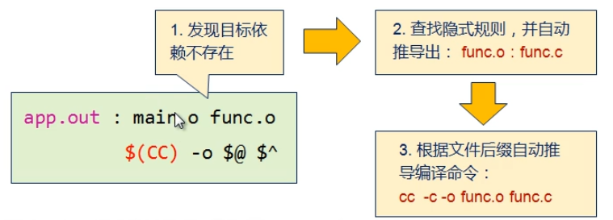

# 运行流程

makefile 运行流程
本文讲述make工具执行makefile的规则。
先回顾一下makefile最基本的语法，如下：
```makefile
targets : prerequisites
    recipe
    …
```

make执行makefile的规则大体为：
1. 扫一遍prerequisites，生成目标（子目标）间的依赖关系，该依赖关系类似树的节点关系；
2. 根据该依赖关系以类似树的后序遍历规则进行目标的生成；

下面以一个例子说明：
```makefile
all: m n
	@echo recipe_all

m: m1 m2
	@echo recipe_m

n: n1 n2 m2
	@echo recipe_n

m1:
	@echo recipe_m1

m2:
	@echo recipe_m2

n1:
	@echo recipe_n1

n2:
	@echo recipe_n2
```

执行make，有如下输出：

```
recipe_m1
recipe_m2
recipe_m
recipe_n1
recipe_n2
recipe_n
recipe_all
```

从以上打印可以得出：
1. make时，首先会扫一遍makefile中各目标的依赖关系；
2. 目标生成的顺序：m1->m2->m->n1->n2->n->all，即类似于树的后序遍历规则进行目标的生成。

再执行命令：make m1，即生成目标m1，输出如下：
```
pre_all
pre_m
pre_n
pre_m1
pre_m2
pre_n1
pre_n2
recipe_m1
```

可得：
1. make时，会生成完整的依赖关系；
2. 不相关目标不会生成。

## 隐式规则依赖运行流程

当make发现目标的依赖不存在时：
- 尝试通过依赖名逐一查找隐式规则；
- 并且通过依赖名推导出可能需要的源文件。



## 查看make的隐式规则

- 查看所有隐式规则：make -p
- 查看具体隐式规则：make -p | grep "XXX"


## 隐式规则副作用
1. 编译行为难以控制,大量使用隐式规则可能产生意想不到的编译行为.
	1. 当依赖的目标不存在时，make会极力组合各种隐式规则对目标进行创建，进而产生意料之外的编译行为。例如:需要名为N.o的目标,隐式规则创建过程为：N.y=>N.c=>N.o
2. 编译效率低下,静态模式规则省去了make推导过程

## 隐式规则的禁用
1. 局部禁用
   ```makefile
   %.o : %.p

   # 在makefile中定义recipe为空
   ```
2. 全局禁用
	```makefile
   make -r
   ```

