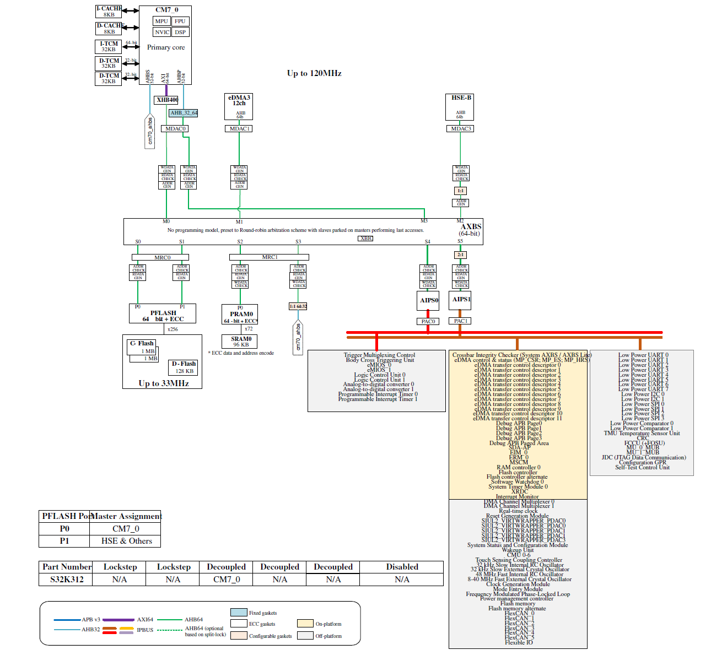
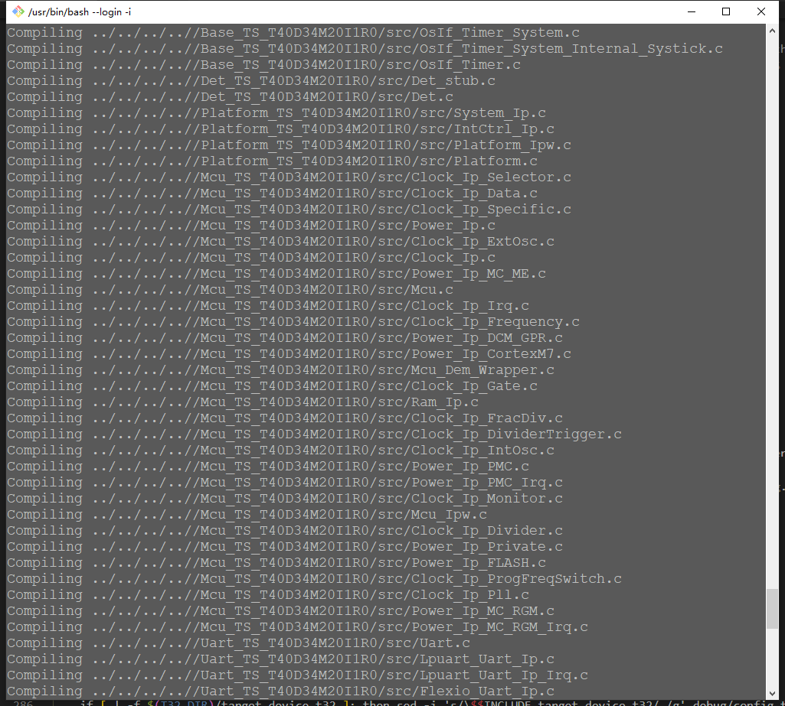
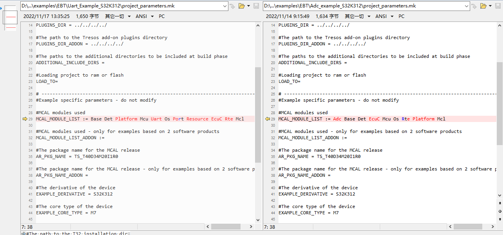
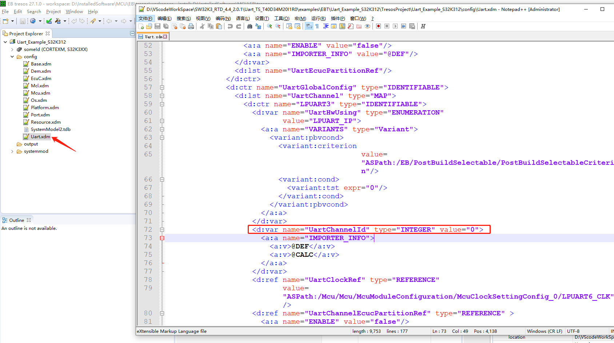

# S32K312

| 类型                     | 大小       | 使用率（估计）                                                             |
| ------------------------ | ---------- | -------------------------------------------------------------------------- |
| flash                    | 2MB        | 500KB左右（小于1M）                                                        |
| RAM                      | 192KB      | 只有业务逻辑+实时系统需要50KB左右，AUTOSAR平台所需的内存未确定             |
| NVM(non-volatile memory) | 128KB      | 30KB左右（包含光机信息）                                                   |
| CPU负载（ECU-Peak-Load） | 主频120Mhz | 命令交互的频繁程度，和CPU的负载相关性很大，空闲情况下，CPU负载很低（<10%） |

## 概要图



### TCM

TCM 是“紧密耦合的记忆”。它是一种超快内存，非常紧密地集成到 CPU 内核中。它与 CPU 缓存非常相似。CPU 缓存是主RAM、flash中的副本，但是TCM具有自己的内存地址，程序员可以完全控制TCM的内容。

TCM 在用于控制系统的 CPU 中很有用，因为 CPU 可以保证非常快速地访问 TCM 中的数据。访问 TCM 中的数据或程序代码比访问系统 RAM 或闪存快得多。因此，TCM 确保更快地执行时间关键代码，更重要的是，它确保代码执行的时间一致。常规 RAM 或闪存中的代码或数据可能会或可能不会在 CPU 缓存中，因此可能执行速度慢或快。

TCM 的缺点是它紧密集成到 CPU 内核中——这意味着 CPU 内核之外的外设可能无法访问它。例如，如果您有一个 USB 端口，它可以通过 DMA 直接从 RAM 传输数据，它可能无法访问 TCM，因为 TCM 没有与 RAM 的其余部分连接到主系统总线。

同样的问题可能发生在多 CPU 或多核系统上。现在考虑操作系统在内核 0 上启动的情况，作为启动的一部分，它正在加载一个关键驱动程序，该驱动程序将直接从内核 1 上的 TCM 运行。内核 0 如何访问内核 1 上的 TCM，如果它是核心 1 内部？

答案是从 TCM 到主系统总线有一个后门（backdoor），以便其他内核和外围设备能够在需要时访问它，但后门是一种缓慢的方法，因此不是它自己的CPU核访问 TCM 的正常方式。

> ITCM(Instruction tightly coupled memory) & DTCM(Data tightly coupled memory)
> ITCM的访问位宽是64位 * 1，DTCM的访问位宽是32位 * 2，指令存放于ITCM，数据存放于DTCM，CPU获得最佳的性能

### 编译问题

```gcc
d:/installedsoftware/mcu/nxp/s32ds.3.5/s32ds/build_tools/gcc_v10.2/gcc-10.2-arm32-eabi/bin/../lib/gcc/arm-none-eabi/10.2.0/../../../../arm-none-eabi/bin/real-ld.exe: warning: d:/installedsoftware/mcu/nxp/s32ds.3.5/s32ds/build_tools/gcc_v10.2/gcc-10.2-arm32-eabi/bin/../lib/gcc/arm-none-eabi/10.2.0/thumb/v7e-m+fp/hard\libgcc.a(_udivmoddi4.o) uses variable-size enums yet the output is to use 32-bit enums; use of enum values across objects may fail
d:/installedsoftware/mcu/nxp/s32ds.3.5/s32ds/build_tools/gcc_v10.2/gcc-10.2-arm32-eabi/bin/../lib/gcc/arm-none-eabi/10.2.0/../../../../arm-none-eabi/bin/real-ld.exe: warning: d:/installedsoftware/mcu/nxp/s32ds.3.5/s32ds/build_tools/gcc_v10.2/gcc-10.2-arm32-eabi/bin/../lib/gcc/arm-none-eabi/10.2.0/../../../../arm-none-eabi/lib/thumb/v7e-m+fp/hard\libg_nano.a(lib_a-memset.o) uses variable-size enums yet the output is to use 32-bit enums; use of enum values across objects may fail
```

gcc 编译选项 -fshort-enums（enum类型等于大小足够的最小整数类型） 或者 -fno-short-enums（无这个选项优化处理）

```c
typedef enum num{
      one = 1,
      two = 2,
      three = 3,
      four = 4,
}NUM;
NUM num1;
//sizeof(num1)不增加这个-fshort-enums选项的时候为4，增加后为大小为1；
//-fno-short-enums则是无这个选项优化处理。gcc是默认没有-fshort-enums这个选项的；
```

编译工具链中附带的静态库libgcc.a在编译时未使用fno-short-enums选项，编译本地源码时指定了fno-short-enums编译选项，因此在链接时产生了告警。如果重新编译ligbcc.a并指定编译选项fno-short-enums，再去编译就没有这个告警。这个告警可以先忽略，对可执行文件没有不良影响。

### uart 示例


开发板uart接口


复制一份代码出来编译和调试，目前不知道这个代码的编译方式，不好弄版本管理。

参考[S32K3_RTD_Training_LPUART_LIN.pdf](C:\Users\APPO\Desktop\S32K3系列软件资料\S32K3官方完整资料包\S32K3\S32K3培训资料\S32K3重庆培训\S32K3_RTD_Training\S32K3_RTD_Training\S32K3_RTD_Training_LPUART_LIN.pdf)

没有打印信息，修改EB配置MCAL。

### 存在一些问题

S32 MCAL gcc 编译脚本没有写好，每次都是全部编译

各个模块之间的会互相引用对应的mcal的src和inclue的文件夹，这是文件布局我也是第一次见。


编译跨模块需要手动指定，在 `project_parameters.mk`



S32 studio 打开是真的慢，打开一次，需要同步很久。

MCAL 没有配置好，依然可以造成BUG。但是可能发现的时间更早。  

###### 编译固件的大小是多少？

只用了一个简单的串口就有100KB

### main 函数接口需要自己去找

main 函数接口需要自己去找，说好的用户可以开发APP，调用RTE的接口就可以了，但是这些RTE的接口我没有找到对应的文档。只能参考各个例子的main函数，看他们是怎么进行调用的。
EB 配置工具很多的参数，编译配置有疏忽也是可以通过的。比如使用串口的时候，串口时钟没有配置，也是可以通过的。但是实际代码运行的时候就死机了。

还有一个问题，RTE是个什么东西，如何调用？autosar 中的VFB到底是怎么调用实际的BSW的呢？

AUTOSAR应用层中的所有活动都是由RTE触发可运行实体来发起的，作为RTE事件的结果。


### .c .h 文件由NXP 的 MACL生产

make generate 生成对应的头文件和源文件

调用对应的RTE的总线，不能调用实际UART口。这就是完全解耦吧。



### autosar 跑RTOS？

### mcal 运行流程难以跟踪和调试


