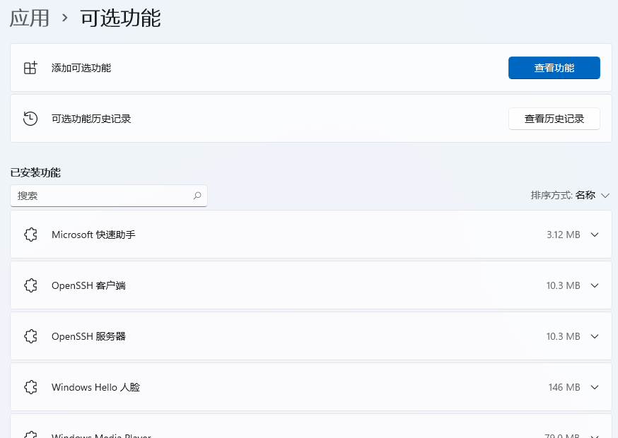
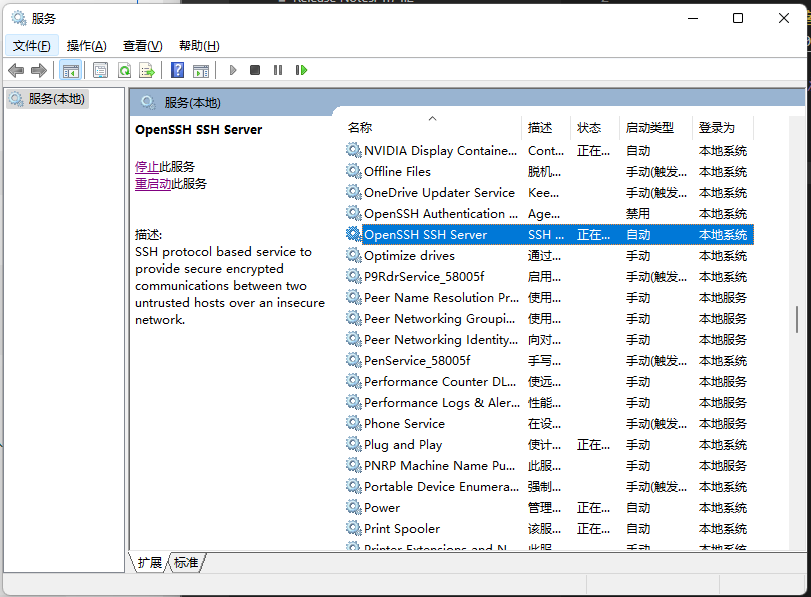

# windows 打开ssh服务

## 安装ssh的服务端和客户端.


> 打开的ssh服务端默认没有密钥,只能使用密码登录

## 打开对应的服务端

打开`运行`,输入`services.msc`,找到如下的服务



## 进行对应的配置

本地生成密钥

```bash
ssh-keygen -t rsa

# 密钥路径 C:\Users\your_userName\.ssh
```

修改`C:\ProgramData\ssh\sshd_config的ssh`配置,开启ssh免密登录功能

```bash
# 修改sshd_config需要管理员权限
# 确保以下3条没有被注释
# 允许公钥授权访问
PubkeyAuthentication yes
# 授权文件存放位置
AuthorizedKeysFile	.ssh/authorized_keys
# 可选，允许密码登录
PasswordAuthentication yes

# 确保以下2条有注释掉
#Match Group administrators
#       AuthorizedKeysFile __PROGRAMDATA__/ssh/administrators_authorized_keys
```

**注意** 重启服务生效
 
## 服务登录配置

C:\Users\your_userName\.ssh 下创建文件 **authorized_keys**, 复制客户端的公钥到 **authorized_keys** 文件,即可进行windows的登录.

> 首次登陆可能会提示是否加入known_hosts，yes即可