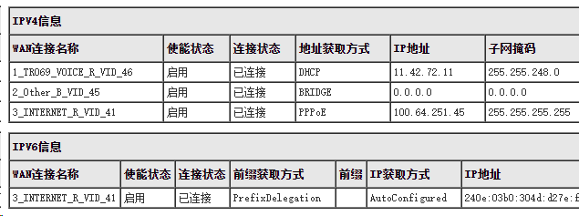
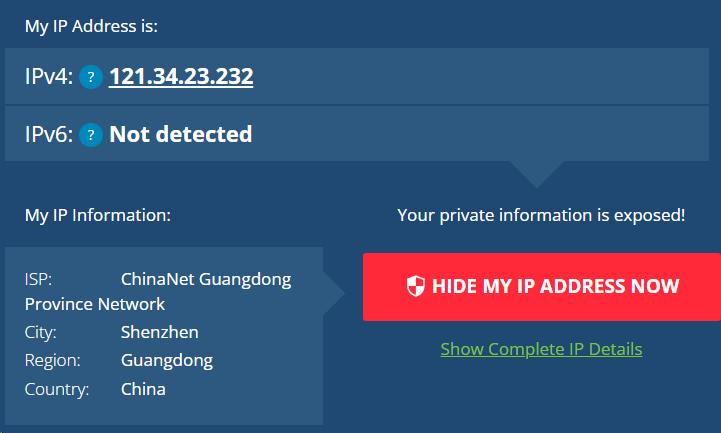

# 搭建内网穿透的windows服务器

## 如何判断自己的IP地址是公网IP？

1. 首先确定pppoe拨号在光猫还是路由器实现，一般来说在光猫上进行pppoe拨号，需要到光猫的设置界面查看WAN的连接信息的pppoe的接口的IP地址，与外网出口的IP地址是否一致。路由器拨号也是看对应wan口ip是否与上网查看的ip一致。
2. 宽带设备的出口ip地址是指拨号的设备的wan口地址。
      
举例:如下图，拨号地址是`100.64.251.45`,宽带出口IP地址是`121.34.23.232`,并没有公网的IP地址.

## 获得ipv6地址

IPv6是大势所趋,运营商后续应该会比较难申请ipv4的公网地址,因此,研究ipv6的内网穿透很有必要.

2022年,目前IPv6的主流配置是不做NAT的，大多数运营商下的大多数IPv6地址都是公网地址，即便是通过路由器配置到你家庭网络内部的设备上也是如此。但是要注意防火墙.

关于ipv6资料:https://www.ipv6-cn.com/about.html

## 获得ipv4地址 

## 遇到问题记录:
1. sshpass在openwrt中不能安装,hiWiFi是通过源码编译的形式进行安装的.
   需要广泛的找别人的帖子中使用过的sshpass.是mips架构的32位处理器的程序.或者拷贝hiwifi固件中的sshpass进程.估计他们开发的时候,图省事,特意编译这个sshpass进去.
   源码:wget http://sourceforge.net/projects/sshpass/files/sshpass/1.05/sshpass-1.05.tar.gz

2. 路由器DHCP模式下,ip不固定.
   光猫的DHCP没有特定的MAC地址绑定IP的功能.并且这个系统如果依赖于光猫的设置,那么移植性就不会太好.

3. windows中ssh服务端密钥登录的设置,等待整理
   | -                                                                | -                                                                       |
   | ---------------------------------------------------------------- | ----------------------------------------------------------------------- |
   | https://zhuanlan.zhihu.com/p/111812831                           | 多台WIN10之间的SSH免密登录 - 知乎                                       |
   | https://segmentfault.com/a/1190000038657243                      | Windows系统下实现服务器SSH免密登录 - 狐七的前端之路 - SegmentFault 思否 |
   | https://www.cnblogs.com/sparkdev/p/10166061.html                 | Windows 支持 OpenSSH 了！ - sparkdev - 博客园                           |
   | http://woshub.com/using-ssh-key-based-authentication-on-windows/ | Configuring SSH Public Key Authentication on Windows                    | Windows OS Hub |
   | https://zhuanlan.zhihu.com/p/404179039                           | Windows OpenSSH 服务器启用密钥登录 - 知乎                               |
   | https://lab.snomiao.com/SNOLAB-481C                              | Windows 启用 OpenSSH Server 及无密码登录操作笔记 ''                     | 雪星实验室     |