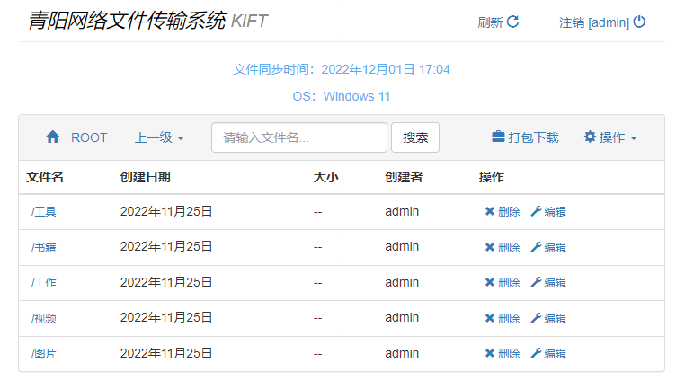
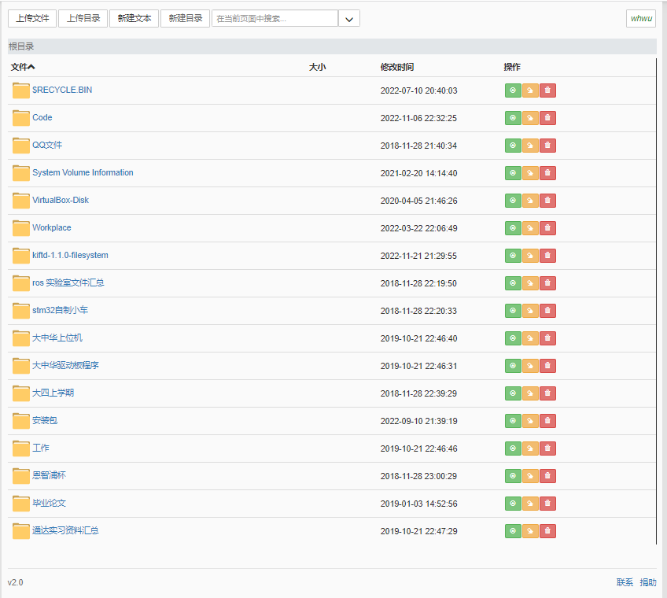

# 开源云盘

记录一些本人使用的开源云盘,想要搭建一个随时访问自己电脑的云盘系统

## kiftd



使用java环境开发的开源云盘系统. 建立了内部的文件系统和数据库,兼容各种操作系统(能跑java就可以运行),完备的文件权限管理.支持webdav协议.

```
filesystem
├─fileblocks
├─filenodes
└─temporaryfiles
```

1. 优秀的文档,搭建云盘快捷,容易上手.
2. 兼容性强,三大主流操作系统都支持.
3. 独立的文件系统,不支持本地windows的原生文件系统,文件吞吐麻烦

## CuteHttpFileServer (chfs)



官方网址: http://iscute.cn/chfs
CuteHttpFileServer/chfs是一个免费的、HTTP协议的文件共享服务器，使用浏览器可以快速访问。跨平台运行，支持主流平台：Windows，Linux和Mac,单个文件，核心功能无需其他文件,完备的文件权限管理.支持webdav协议.

1. 使用windows原生文件系统,文件交互很方便!