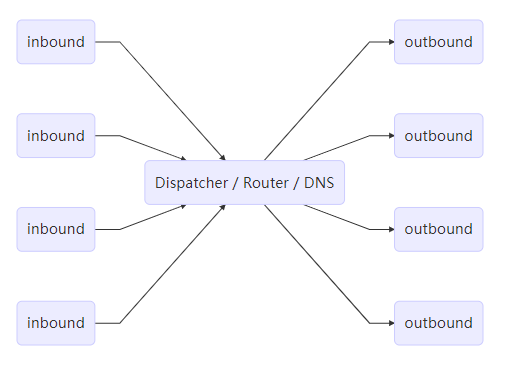

# V2Ray

V2Ray 是 Project V 下的一个工具。Project V 是一个包含一系列构建特定网络环境工具的项目，而 V2Ray 属于最核心的一个。从时间上来说，先有 V2Ray 才有 Project V。V2Ray 是一个与 Shadowsocks 类似的代理软件，可以用来科学上网（翻墙）学习国外先进科学技术。

用户手册 [https://www.v2ray.com](https://www.v2ray.com)

## 简介

V2Ray 使用 inbound(传入) 和 outbound(传出) 的结构，这样的结构非常清晰地体现了数据包的流动方向，如下：



- 当有多个出站协议时，可以配置路由（Routing）来指定某一类流量由某一个出站协议发出.
- inbound 可以多个，分别支持sock5、http等
- 路由会在必要时查询 DNS 以获取更多信息来进行判断。
- outbound会通过DNS将域名解析为IP
- 入站协议收到数据之后，会交给分发器（Dispatcher）进行分发；

代理
```
{浏览器} <--(socks)--> {V2Ray 客户端 inbound <-> V2Ray 客户端 outbound} <--(VMess)-->  {V2Ray 服务器 inbound <-> V2Ray 服务器 outbound} <--(Freedom)--> {目标网站}
```

直连
```
{浏览器} <--(socks)--> {V2Ray 客户端 inbound <-> V2Ray 客户端 outbound} <--(Freedom)--> {目标网站}
```

## 配置

```json
{
  "log": {},
  "api": {},
  "dns": {},
  "stats": {},
  "routing": {},
  "policy": {},
  "reverse": {},
  "inbounds": [],
  "outbounds": [],
  "transport": {}
}
```

参考 [https://www.v2ray.com/chapter_02/01_overview.html](https://www.v2ray.com/chapter_02/01_overview.html)
