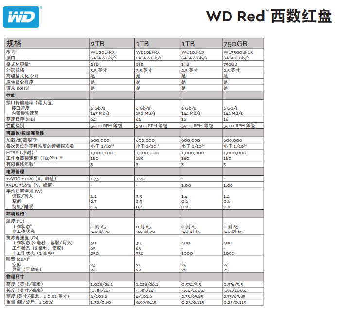
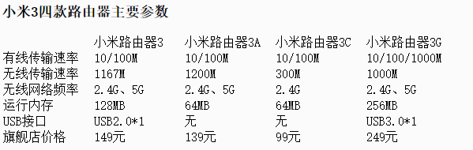

# 选择带USB接口的路由器

NAS的想法是路由器外接一个硬盘，实现多媒体文件的自动离线下载，同时实现DDNS内网穿透，随时随地访问的多媒体云。

## 外接硬盘

1. 硬盘的供电
   - 移动硬盘的话，常见的2.5寸硬盘盒‍需要0.5~0.9A的5V供电启动。可以算出，电机启动瞬时大功率需求，大约是0.9*5=4.5W。过了启动阶段，这个电源需求会降低
   - 3.5寸硬盘，同时要求12V和5V供电，并且启动瞬时功率需要30W以上
   - USB 2.0 5V 0.5A
   - USB 3.0 5V 0.9A, USB 3.0的电源供应就足够2.5寸硬盘供电。
   - USB 3.1定义了多个USB电力传递模式，大功率可以达到100W——不过一般只用于电源适配器向电脑/设备供电,目前还没看到支持反向供电100W的主板上市。
	> 早期的主板不支持USB 3.0的，如果移动硬盘里面的机械硬盘用的是0.9A启动的型号，经常会出现插上去不认盘的现象

2. 硬盘的读写
   - 家用级的2.5寸硬盘，读写速度一般在75~150MB/s之间
   - 3.5寸硬盘，已经可以达到100~200MB/s

3. 硬盘容量
   - 标准盘体（9.5mm厚）2.5寸硬盘盒‍只能做到2TB
   - 超厚盘体（12.7mm）2.5寸硬盘盒‍才能达到4TB
   - 3.5寸硬盘，已经有12TB容量的在售

4. 机械硬盘的抗震
   - 硬盘抗冲击里的 Gs 中 G 与 s 分别代表两个物理量，其中大写的 G 代表的是重力加速度，而小写的 s 代表的是时间(秒)。合在一起的意思是，单位时间(秒)内的重力加速度变化值。
   - 
   - 机械硬盘防震 TBD

## 路由器的选择

需要一个价格便宜，具有USB3.0接口的路由器，支持第三方固件刷入，最好支持千兆网络。

小米路由器支持老毛子padavan固件（贴吧信息），价格便宜，3系是2016年量产，其中一款小米路由器3G是千兆路由器，性价比高。

还对比了同期（250元内）名气比较大的路由器：小米路由器3G 腾达AC9 网件R6220 斐讯K2P

其他的路由器的USB接口都是USB2.0，接移动硬盘有供电风险。选中了小米路由器3G （R3G）

## 文件共享服务

转而思考小米路由器3G提供webdav服务共享给软路由，尽可能的减少路由器性能消耗。由高性能软路由提供多媒体服务。

思考如何最简单的webdav服务搭建？

性能消耗：

可道云（php）kiftd（Java）> chfs（C 语言）> Caddy(Go) > hacdias/webdav(Go 功能单一)

可道云、kiftd等高级语言写的私有云系统都是基于数据库，chfs、Caddy、hacdias/webdav都是基于系统的文件系统，消耗更小。

[对于文件服务器极简性能的交流帖](https://www.v2ex.com/t/766471)
## 离线下载

aria2优秀的地方：
- 支持 BitTorrent Metalink 协议
- 远程控制（通过 web 端）下载进程
- 支持多线程下载
- 支持迅雷链接下载
- 搭配Chrome插件 `迅雷离线助手`,可以实现远程推送,自动下载

## DDNS内网穿透

Nginx + frp 实现多域名ssl加密访问.

## 软路由搭建方案

软路由的主流方案都是作为主路由,作为光猫桥接后的主要路由器,可以充分的利用的带宽资源.硬路由只是作为一个无线AP.

软件系统一是采用openwrt或者第三方定制系统(基于openwrt),由此可以使用现有的系统中开源的各类插件,迅速实现需要的nas功能.

二是采用群辉等专业nas系统,依托于社区环境的丰富插件,方便的实现很多性能要求很高的功能.

冷门的方案:
- 单网口软路由
- Ubuntu系列linux系统搭建软路由
- WSL虚拟机软路由

