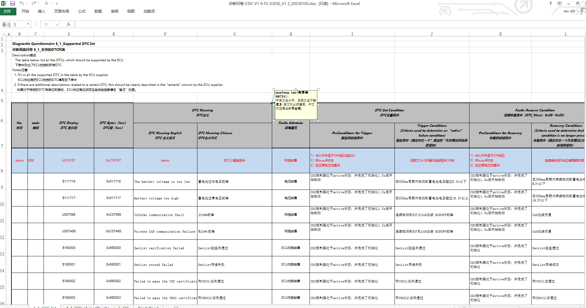
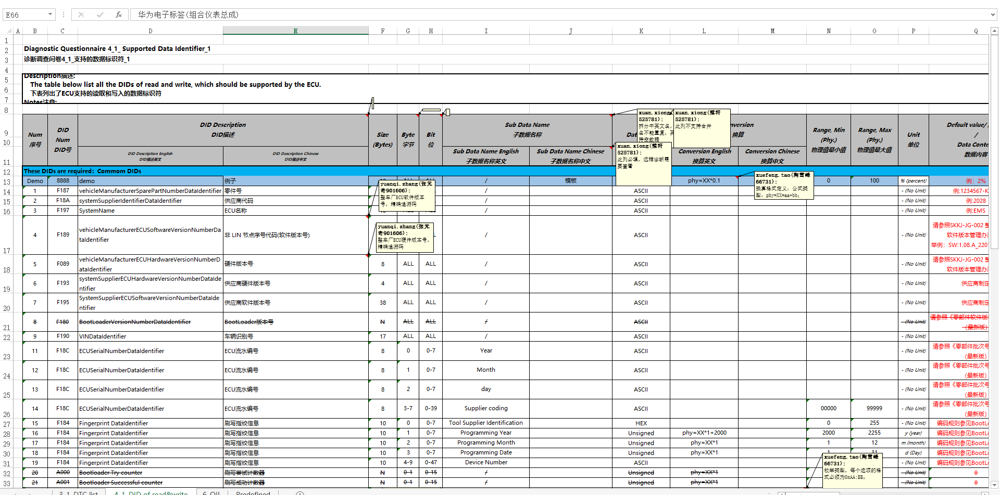

# 车载软件术语

## 车辆诊断调查

车机厂生产环境中使用的表格示例如下：

| 术语         | 解释                                                           |
| ------------ | -------------------------------------------------------------- |
| DTC          | DTC 是诊断故障代码的缩写，是用于诊断车辆或重型设备故障的代码。 |
| MIL          | 故障指示灯，梯形驾驶员存在的问题                               |
| VIN          | 车辆识别号码                                                   |
| DID          | 数据标识符，UDS请求服务位于SID，可进一步配置可选的子功能字节   |
| OBD2、J1939  | 车辆诊断系统协议，美国主导                                     |
| UDS、KWP2000 | 车辆诊断系统协议，欧洲主导                                     |

### OBD-2 DTC标准

DTC 代码长度为五个字符。DTC 中的每个字符提供有关车辆问题的不同信息。 

### DID

数据标识符，UDS请求服务位于SID，可进一步配置可选的子功能字节

### UDS协议

统一诊断服务 (UDS) 是一种汽车协议，允许诊断系统与 ECU 通信以诊断故障并相应地对 ECU 重新编程，之所以称为统一，是因为它结合并整合了所有标准，如KWP 2000、ISO 15765 等

UDS 软件堆栈的主要功能之一是将车辆发生的每个问题的故障代码存储在 ECU 内存中，并在需要时将其传输（至客户端）。UDS协议诊断测试仪工具有一个 GUI，可以连接到 ECU，检索故障代码并显示它。

UDS协议基于CAN、K-Line 或 FlexRay

**UDS 协议栈提供的服务：**
1. 数据传输能力
   - UDS 协议栈的数据传输能力使客户端能够从 ECU 读取或写入任何信息。可以根据标识符和周期标识符读取或写入数据。客户端也可以从指定地址的物理内存中读取数据。
   - 这些信息的范围可以从静态信息（如 ECU 序列号）到一些实时数据（如传感器的当前状态、发动机转速等）
   - 如果客户希望 ECU 定期发送服务值，则需要“通过标识符定期读取数据”服务。客户端也可以通过标识符和地址写入数据。使用写入服务，可以更改某些参数，例如阈值和角度
   - 通常，可以通过使用“安全访问服务”限制访问来控制将一些敏感数据写入 ECU 的权限。此类权限由 OEM 保留，因为将数据写入 ECU 会干扰车辆的安全性和整体功能
2. 故障诊断
   - UDS 协议的主要服务之一是故障诊断。每当车辆出现问题时，与故障对应的诊断故障代码 (DTC) 就会存储在 ECU 故障代码存储器 (FCM) 中。车库的服务人员可以使用 ReadDTCInformation 服务检索这些 DTC
3. 上传/下载功能
   - UDS 协议还支持 ECU 重新编程。ECU重新编程是指更新ECU软件。这是解决任何现有错误或在 ECU 中添加新开发的模块所必需的。
4. 远程例程激活
   - 车辆诊断可能需要在给定参数范围内测试故障组件。此外，在车辆的测试阶段，一些系统测试可能需要运行一段时间。

### 参考链接

[UDS 解释 - 简单介绍（统一诊断服务）](https://www.csselectronics.com/pages/uds-protocol-tutorial-unified-diagnostic-services)

[每个汽车产品开发团队都应该了解的 4 种 UDS 协议软件服务](https://www.embitel.com/blog/embedded-blog/4-uds-protocol-services-every-automotive-geek-should-know)

[DTC 代码理解指南](https://www.samsara.com/guides/dtc-codes/)