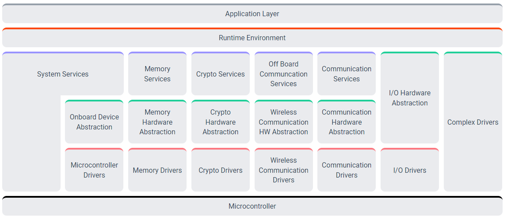

# autosar

## 简要介绍 & 一些名词

| 名词 | 含义                                            |
| ---- | ----------------------------------------------- |
| SW-C | Software Component (SW-C)：软件组件             |
| VFB  | Virtual Functional Bus (VFB)：虚拟功能总线      |
| RTE  | Runtime Environment (RTE)：运行环境（实时环境） |
| BSW  | Basic Software（BSW）:基础软件                  |

开发流程


概要图


主要内容是如下四个部分
- 应用层
- RTE
- BSW
- 方法论

## 方法论

#### 什么是ARXML，如何使用ARXML？

- XML （eXtensible Markup Language）可扩展标记语言，是一种类似于 HTML的标记语言，它的设计宗旨是传输数据，而非显示数据，XML 具有自我描述性，其标签没有被预定义，需要自行定义。HTML 旨在显示信息，而 XML 旨在传输信息。在xml文件的基础上，AUTOSAR规范基于汽车电子的应用场景，将传输信息的文件格式定义为arxml，ar即architecture。
  
#### ARXML的结构

```XML
<?xml version="1.0" encoding="UTF-8" standalone="no"?>
<bookstore>
<book category="汽车电控">
  <title>汽车电子的ARXML文件解读</title>
  <author>Demu</author>
  <year>2021</year>
  <price>35.00</price>
</book>
<book category="机械制造">
  <title>内燃机学</title>
  <author>周龙保</author>
  <year>2005</year>
  <price>36.00</price>
</book>
</bookstore>
```

#### ARXML的应用

在AUTOSAR规范下，ARXML文档的解析均已实现工具化，如Vector DavinciDeveloper、Artop、AutosarExplorer等，当然也有部分企业基于Eclipse自主开发了工具。将ARXML文件导入支持其文件格式的工具，可查看到里面的信息。

首先，鉴于整车OEM更加关注系统应用层功能，因而，OEM端将提供系统的描述文件，文件中包含ECU的应用功能需求，不包含基础软件组件。

然后，控制器供应商基于OEM提供的系统描述文档，加载到工具链，引入系统的虚拟功能总线上，即AUTOSAR RTE层的VFB，如此就可以和系统的其它模块进行通讯。

最后，因OEM提供的系统功能描述文件包含了系统部件到ECU的映射关系，信号的映射关系，供应商可进行ECU内部硬件结构和接口的设计，并将信号分配给实际的接口，如此就完成了arxml创建。

### 参考网址：
- [AUTOSAR 4.4.0 版本](https://www.autosar.org/standards/classic-platform/classic-platform-440/)
- 

  